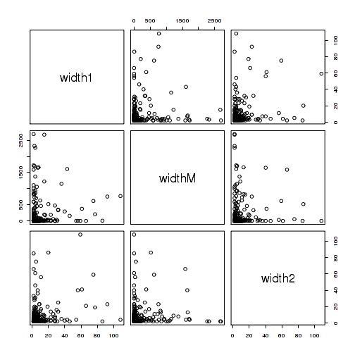
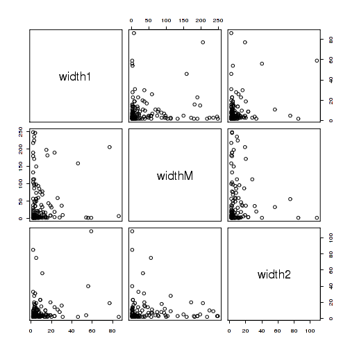

Run GEE with AR1 working correlation
===================================

# Setup

## Libraries

<pre class="knitr r">## Load libraries
## Available from http://cran.r-project.org/web/packages/getopt/index.html
# install.packages("getopt")
library("getopt")

## Available from http://cran.at.r-project.org/web/packages/knitrBootstrap/index.html
# install.packages("knitrBootstrap")
library("knitrBootstrap")

# --- Specify any other libraries you need
# --- Not needed (since you load them in template.R), but good for the report
# --- Anyhow, just copying and pasting from template.R is good
## gee
# install.packages("geepack")
library("geepack")

## for mclapply
library("parallel")
</pre>

## Directories

<pre class="knitr r">## Chr
chr <- paste0("chr", opt$chrnum)
chrnum <- as.numeric(opt$chrnum)

## Create dir to save files
if(opt$verbose) message("Creating directories")
</pre>

<pre class="knitr r">## Creating directories
</pre>

<pre class="knitr r">ddir <- file.path(opt$dirResult, opt$project, chr) # data directory (might change say if step2 uses the results from step2)
wdir <- file.path(opt$dirResult, opt$project, chr, opt$results) # working dir
dir.create(wdir, recursive=TRUE)
</pre>

<pre class="knitr r">## Warning:
## '/home/bst/student/lcollado/756final_code/results/derHippo/chr22/geeAR1'
## already exists
</pre>

<pre class="knitr r">
## Want to save some 'object'? Use:
# save(object, file=file.path(wdir, "object.Rdata"))
</pre>

# GEE AR1

<pre class="knitr r">## Load data
load(file.path(ddir, "covdata.Rdata"))
load(file.path(ddir, "pairs.Rdata"))

## How many region pairs are small?
nrow(subset(pairs, width1 > 1 & width2 > 1)) / nrow(pairs) * 100
</pre>

<pre class="knitr r">## [1] 40.66
</pre>

<pre class="knitr r">nrow(subset(pairs, width1 > 1 & widthM > 1 & width2 > 1)) / nrow(pairs) * 100
</pre>

<pre class="knitr r">## [1] 30.72
</pre>

<pre class="knitr r">nrow(subset(pairs, width1 > 2 & width2 > 2)) / nrow(pairs) * 100
</pre>

<pre class="knitr r">## [1] 24.96
</pre>

<pre class="knitr r">nrow(subset(pairs, width1 > 2 & widthM > 2 & width2 > 2)) / nrow(pairs) * 100
</pre>

<pre class="knitr r">## [1] 16.58
</pre>

<pre class="knitr r">
## Are some of them too long for GEE?
clen <- sapply(covdata, nrow)
summary(clen)
</pre>

<pre class="knitr r">##    Min. 1st Qu.  Median    Mean 3rd Qu.    Max. 
##      75     225     525    6150    4180   73600
</pre>

<pre class="knitr r">nrow(subset(pairs, widthM < 500)) / nrow(pairs) * 100
</pre>

<pre class="knitr r">## [1] 86.04
</pre>

<pre class="knitr r">nrow(subset(pairs, widthM < 250)) / nrow(pairs) * 100
</pre>

<pre class="knitr r">## [1] 80.1
</pre>

<pre class="knitr r">
## Choose a final index
nrow(subset(pairs, width1 > 1 & width2 > 1)) / nrow(pairs) * 100
</pre>

<pre class="knitr r">## [1] 40.66
</pre>

<pre class="knitr r">summary(subset(pairs, width1 > 1 & width2 > 1))
</pre>

<pre class="knitr r">##      start1              end1              startM        
##  Min.   :18070704   Min.   :18070705   Min.   :18070706  
##  1st Qu.:36863337   1st Qu.:36863346   1st Qu.:36863347  
##  Median :39711493   Median :39711515   Median :39711516  
##  Mean   :37324674   Mean   :37324683   Mean   :37324684  
##  3rd Qu.:41755475   3rd Qu.:41755478   3rd Qu.:41755479  
##  Max.   :51170990   Max.   :51170992   Max.   :51170993  
##       endM              start2              end2             cluster   
##  Min.   :18072427   Min.   :18072428   Min.   :18072431   Min.   :  2  
##  1st Qu.:36863347   1st Qu.:36863348   1st Qu.:36863349   1st Qu.: 85  
##  Median :39711516   Median :39711517   Median :39711523   Median :124  
##  Mean   :37324895   Mean   :37324896   Mean   :37324905   Mean   :115  
##  3rd Qu.:41755480   3rd Qu.:41755481   3rd Qu.:41755488   3rd Qu.:149  
##  Max.   :51171396   Max.   :51171397   Max.   :51171401   Max.   :204  
##      width1          widthM         width2          widthNoM    
##  Min.   :  2.0   Min.   :   1   Min.   :  2.00   Min.   :  4.0  
##  1st Qu.:  2.0   1st Qu.:   2   1st Qu.:  3.00   1st Qu.:  7.0  
##  Median :  4.0   Median :   8   Median :  4.00   Median : 11.0  
##  Mean   : 10.1   Mean   : 212   Mean   :  9.52   Mean   : 19.7  
##  3rd Qu.:  9.0   3rd Qu.: 159   3rd Qu.:  9.00   3rd Qu.: 21.0  
##  Max.   :108.0   Max.   :2692   Max.   :108.00   Max.   :167.0
</pre>

<pre class="knitr r">with(subset(pairs, width1 > 1 & width2 > 1), pairs(~width1 + widthM + width2))
</pre>

<pre class="knitr r">
nrow(subset(pairs, width1 > 1 & widthM < 500 & width2 > 1)) / nrow(pairs) * 100
</pre>

<pre class="knitr r">## [1] 34.9
</pre>

<pre class="knitr r">summary(subset(pairs, width1 > 1 & widthM < 500 & width2 > 1))
</pre>

<pre class="knitr r">##      start1              end1              startM        
##  Min.   :18073382   Min.   :18073383   Min.   :18073384  
##  1st Qu.:37459164   1st Qu.:37459175   1st Qu.:37459176  
##  Median :39713088   Median :39713120   Median :39713120  
##  Mean   :37780917   Mean   :37780926   Mean   :37780927  
##  3rd Qu.:41911819   3rd Qu.:41911820   3rd Qu.:41911822  
##  Max.   :51170990   Max.   :51170992   Max.   :51170993  
##       endM              start2              end2             cluster   
##  Min.   :18073387   Min.   :18073388   Min.   :18073389   Min.   :  2  
##  1st Qu.:37459181   1st Qu.:37459182   1st Qu.:37459188   1st Qu.: 90  
##  Median :39713148   Median :39713150   Median :39713240   Median :124  
##  Mean   :37780977   Mean   :37780978   Mean   :37780986   Mean   :117  
##  3rd Qu.:41911822   3rd Qu.:41911823   3rd Qu.:41911826   3rd Qu.:151  
##  Max.   :51171396   Max.   :51171397   Max.   :51171401   Max.   :204  
##      width1          widthM          width2          widthNoM    
##  Min.   : 2.00   Min.   :  1.0   Min.   :  2.00   Min.   :  4.0  
##  1st Qu.: 2.00   1st Qu.:  1.0   1st Qu.:  3.00   1st Qu.:  7.0  
##  Median : 4.00   Median :  4.0   Median :  4.00   Median : 11.0  
##  Mean   : 9.32   Mean   : 51.9   Mean   :  8.95   Mean   : 18.3  
##  3rd Qu.: 9.00   3rd Qu.: 40.2   3rd Qu.:  9.00   3rd Qu.: 20.0  
##  Max.   :86.00   Max.   :477.0   Max.   :108.00   Max.   :167.0
</pre>

<pre class="knitr r">with(subset(pairs, width1 > 1 & widthM < 500 & width2 > 1), pairs(~width1 + widthM + width2))
</pre>

<pre class="knitr r">
nrow(subset(pairs, width1 > 1 & widthM < 250 & width2 > 1)) / nrow(pairs) * 100
</pre>

<pre class="knitr r">## [1] 32.64
</pre>

<pre class="knitr r">summary(subset(pairs, width1 > 1 & widthM < 250 & width2 > 1))
</pre>

<pre class="knitr r">##      start1              end1              startM        
##  Min.   :18073382   Min.   :18073383   Min.   :18073384  
##  1st Qu.:37459151   1st Qu.:37459160   1st Qu.:37459160  
##  Median :39711517   Median :39711523   Median :39711524  
##  Mean   :37686078   Mean   :37686086   Mean   :37686087  
##  3rd Qu.:41755432   3rd Qu.:41755438   3rd Qu.:41755439  
##  Max.   :51170983   Max.   :51170984   Max.   :51170985  
##       endM              start2              end2             cluster   
##  Min.   :18073387   Min.   :18073388   Min.   :18073389   Min.   :  2  
##  1st Qu.:37459162   1st Qu.:37459163   1st Qu.:37459170   1st Qu.: 90  
##  Median :39711524   Median :39711525   Median :39711560   Median :124  
##  Mean   :37686115   Mean   :37686116   Mean   :37686124   Mean   :116  
##  3rd Qu.:41755477   3rd Qu.:41755478   3rd Qu.:41755483   3rd Qu.:149  
##  Max.   :51170989   Max.   :51170990   Max.   :51170992   Max.   :204  
##      width1          widthM          width2          widthNoM    
##  Min.   : 2.00   Min.   :  1.0   Min.   :  2.00   Min.   :  4.0  
##  1st Qu.: 2.00   1st Qu.:  1.0   1st Qu.:  3.00   1st Qu.:  7.0  
##  Median : 4.00   Median :  3.0   Median :  4.00   Median : 11.0  
##  Mean   : 8.75   Mean   : 29.7   Mean   :  8.85   Mean   : 17.6  
##  3rd Qu.: 9.00   3rd Qu.: 24.5   3rd Qu.:  9.00   3rd Qu.: 19.0  
##  Max.   :86.00   Max.   :249.0   Max.   :108.00   Max.   :167.0
</pre>

<pre class="knitr r">with(subset(pairs, width1 > 1 & widthM > 1 & widthM < 250 & width2 > 1), pairs(~width1 + widthM + width2))
</pre>

<pre class="knitr r">
## Use regions with width1 > 1, width2 > 1 and widthM < 250
pairs.use <- with(pairs, which(width1 > 1 & widthM < 250 & width2 > 1))

## Subset data set
covdata.used <- covdata[pairs.use]
names(covdata.used) <- pairs.use
pairs.used <- pairs[pairs.use, ]

## Save subsets
save(covdata.used, file=file.path(wdir, "covdata.used.Rdata"))
save(pairs.used, file=file.path(wdir, "pairs.used.Rdata"))

## Run GEE
# idx <- seq_len(length(covdata.used))
# testing:
idx <- 1:2
myGEE <- function(i, corstr) {
	geeglm(coverage ~ sampleDepth + group + region, id = sample, data = covdata.used[[i]], family = gaussian, corstr = corstr)
}

## GEE AR1
if(opt$verbose) message(paste(Sys.time(), "running GEE with AR1"))
</pre>

<pre class="knitr r">## 2013-12-14 18:05:05 running GEE with AR1
</pre>

<pre class="knitr r">geeAR1 <- mclapply(idx, myGEE, corstr="ar1", mc.cores=20)
names(geeAR1) <- names(covdata.used)[idx]
save(geeAR1, file=file.path(wdir, "geeAR1.Rdata"))

## Show an example:
summary(geeAR1[[1]])
</pre>

<pre class="knitr r">## 
## Call:
## geeglm(formula = coverage ~ sampleDepth + group + region, family = gaussian, 
##     data = covdata.used[[i]], id = sample, corstr = corstr)
## 
##  Coefficients:
##               Estimate  Std.err  Wald Pr(>|W|)    
## (Intercept)    3.45978  0.68553 25.47  4.5e-07 ***
## sampleDepth    0.06232  0.02346  7.06   0.0079 ** 
## groupCO       -0.16570  0.03466 22.85  1.8e-06 ***
## groupETOH     -0.15087  0.03638 17.20  3.4e-05 ***
## regionregionM  0.00148  0.00413  0.13   0.7203    
## regionregion2  0.00615  0.00430  2.05   0.1527    
## ---
## Signif. codes:  0 '***' 0.001 '**' 0.01 '*' 0.05 '.' 0.1 ' ' 1
## 
## Estimated Scale Parameters:
##             Estimate Std.err
## (Intercept)  0.00383 0.00124
## 
## Correlation: Structure = ar1  Link = identity 
## 
## Estimated Correlation Parameters:
##       Estimate Std.err
## alpha    0.972  0.0094
## Number of clusters:   25   Maximum cluster size: 8
</pre>

<pre class="knitr r">

## Extract region2 coef estimate, st.error, and Wald stat
myGEE.stat <- function(y) {
	beta <- c(coef(y)["regionregion2"], y$geese$alpha)
	## Assumes that geeglm(std.err="san.se") which is the default value
	vbeta <- sqrt(c(y$geese$vbeta[6, 6], y$geese$valpha))
	wald <- (beta/vbeta)^2
	pval <- 1 - pchisq(wald, df=1)
	df <- data.frame(coef=c("region2", "alpha"), estimate=beta, stderr=vbeta, wald=wald, pval=pval)
	rownames(df) <- seq_len(nrow(df))
	return(df)
}
geeAR1.stat <- lapply(geeAR1, myGEE.stat)
save(geeAR1.stat, file=file.path(wdir, "geeAR1.stat.Rdata"))

## Show an example:
geeAR1.stat[[1]]
</pre>

<pre class="knitr r">##      coef estimate stderr     wald  pval
## 1 region2  0.00615 0.0043     2.05 0.153
## 2   alpha  0.97228 0.0094 10704.68 0.000
</pre>

# Reproducibility

Date the report was generated.

<pre class="knitr r">## [1] "2013-12-14 18:05:09 EST"
</pre>

Wallclock time spent generating the report.

<pre class="knitr r">## Time difference of 6.15 secs
</pre>

`R` session information.

<pre class="knitr r">## R version 3.0.2 Patched (2013-10-17 r64066)
## Platform: x86_64-unknown-linux-gnu (64-bit)
## 
## locale:
##  [1] LC_CTYPE=en_US.iso885915       LC_NUMERIC=C                  
##  [3] LC_TIME=en_US.iso885915        LC_COLLATE=en_US.iso885915    
##  [5] LC_MONETARY=en_US.iso885915    LC_MESSAGES=en_US.iso885915   
##  [7] LC_PAPER=en_US.iso885915       LC_NAME=C                     
##  [9] LC_ADDRESS=C                   LC_TELEPHONE=C                
## [11] LC_MEASUREMENT=en_US.iso885915 LC_IDENTIFICATION=C           
## 
## attached base packages:
## [1] parallel  stats     graphics  grDevices utils     datasets  base     
## 
## other attached packages:
## [1] geepack_1.1-6        knitrBootstrap_0.9.0 getopt_1.20.0       
## 
## loaded via a namespace (and not attached):
## [1] Cairo_1.5-3    evaluate_0.5.1 formatR_0.10   knitr_1.5     
## [5] markdown_0.6.3 stringr_0.6.2  tools_3.0.2
</pre>

