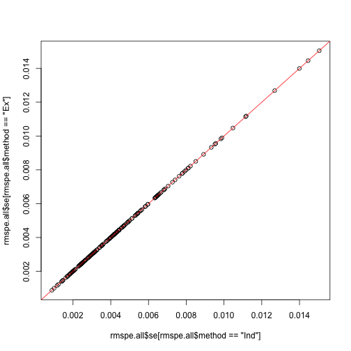
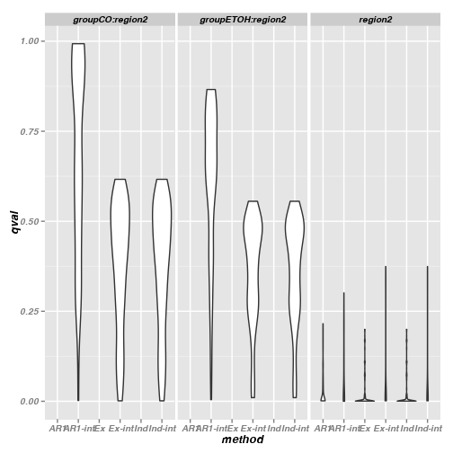
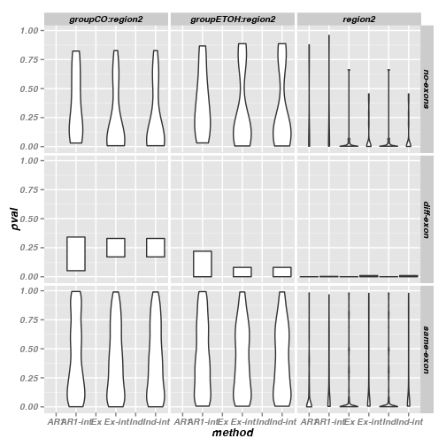
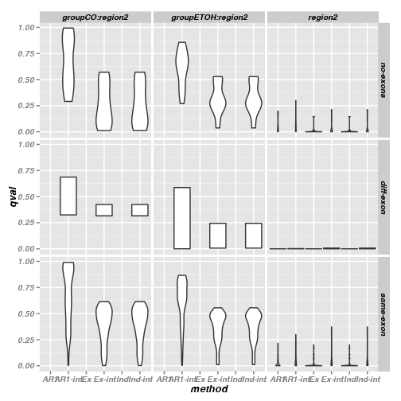

Calculate RMSPE, qvalues and compare with exons
===============================================

# Setup

## Libraries

<pre class="knitr r">## Load libraries
## Available from http://cran.r-project.org/web/packages/getopt/index.html
# install.packages("getopt")
library("getopt")

## Available from http://cran.at.r-project.org/web/packages/knitrBootstrap/index.html
# install.packages("knitrBootstrap")
library("knitrBootstrap")

# --- Specify any other libraries you need
# --- Not needed (since you load them in template.R), but good for the report
# --- Anyhow, just copying and pasting from template.R is good
# install.packages("cvTools")
library("cvTools")

# install.packages("geepack")
library("geepack")

# install.packages("ggplot2")
library("ggplot2")

# source("http://bioconductor.org/biocLite.R")
# biocLite("qvalue")
library("qvalue")

# source("http://bioconductor.org/biocLite.R")
# biocLite("GenomicRanges")
library("GenomicRanges")
</pre>

## Directories

<pre class="knitr r">## Chr
chr <- paste0("chr", opt$chrnum)
chrnum <- as.numeric(opt$chrnum)

## Create dir to save files
if(opt$verbose) message("Creating directories")
</pre>

<pre class="knitr r">## Creating directories
</pre>

<pre class="knitr r">ddir <- file.path(opt$dirResult, opt$project, chr) # data directory (might change say if step2 uses the results from step2)
wdir <- file.path(opt$dirResult, opt$project, chr, opt$results) # working dir
dir.create(wdir, recursive=TRUE)
</pre>

<pre class="knitr r">## Warning:
## '/Users/lcollado/enigma2/756final_code/results/derHippo/chr22/rmspe'
## already exists
</pre>

<pre class="knitr r">
## Want to save some 'object'? Use:
# save(object, file=file.path(wdir, "object.Rdata"))
</pre>

# RMSPE

<pre class="knitr r">load(file.path(ddir, "geeAR1", "geeAR1.Rdata"))
load(file.path(ddir, "geeInd", "geeInd.Rdata"))
load(file.path(ddir, "geeEx", "geeEx.Rdata"))
load(file.path(ddir, "geeAR1", "geeAR1.int.Rdata"))
load(file.path(ddir, "geeInd", "geeInd.int.Rdata"))
load(file.path(ddir, "geeEx", "geeEx.int.Rdata"))
</pre>

## Calculate the RMSPE

<pre class="knitr r">rmspe.all <- vector("list", length(geeAR1))
names(rmspe.all) <- names(geeAR1)

rmspe.all <- lapply(names(rmspe.all), function(x) {
	ar <- unlist(rmspe(y=geeAR1[[x]]$y, yHat=geeAR1[[x]]$fitted.values, includeSE=TRUE))
	ind <- unlist(rmspe(y=geeInd[[x]]$y, yHat=geeInd[[x]]$fitted.values, includeSE=TRUE))
	ex <- unlist(rmspe(y=geeEx[[x]]$y, yHat=geeEx[[x]]$fitted.values, includeSE=TRUE))
	ar.i <- unlist(rmspe(y=geeAR1.int[[x]]$y, yHat=geeAR1.int[[x]]$fitted.values, includeSE=TRUE))
	ind.i <- unlist(rmspe(y=geeInd.int[[x]]$y, yHat=geeInd.int[[x]]$fitted.values, includeSE=TRUE))
	ex.i <- unlist(rmspe(y=geeEx.int[[x]]$y, yHat=geeEx.int[[x]]$fitted.values, includeSE=TRUE))
	df <- data.frame(rbind(ar, ind, ex, ar.i, ind.i, ex.i))
	df$method <- factor(c("AR1", "Ind", "Ex", "AR1-int", "Ind-int", "Ex-int"))
	df$pairID <- rep(as.integer(x), 6)
	rownames(df) <- NULL
	return(df)
})
rmspe.all <- do.call(rbind, rmspe.all)
save(rmspe.all, file=file.path(wdir, "rmspe.all.Rdata"))
</pre>

## Explore the results

<pre class="knitr r">ggplot(rmspe.all, aes(x=method, y=log(rmspe))) + geom_violin()
</pre>

<pre class="knitr r">ggplot(rmspe.all, aes(x=method, y=se)) + geom_violin()
</pre>

<pre class="knitr r">plot(rmspe.all$rmspe[rmspe.all$method=="Ind"], rmspe.all$rmspe[rmspe.all$method=="Ex"])
abline(0, 1, col="red")
</pre>

<pre class="knitr r">plot(rmspe.all$rmspe[rmspe.all$method=="Ex"], rmspe.all$rmspe[rmspe.all$method=="AR1"])
abline(0, 1, col="red")
</pre>

<pre class="knitr r">plot(rmspe.all$rmspe[rmspe.all$method=="Ex"], rmspe.all$rmspe[rmspe.all$method=="AR1-int"])
abline(0, 1, col="red")
</pre>

<pre class="knitr r">plot(rmspe.all$rmspe[rmspe.all$method=="Ex"], rmspe.all$rmspe[rmspe.all$method=="Ex-int"])
abline(0, 1, col="red")
</pre>

<pre class="knitr r">plot(rmspe.all$rmspe[rmspe.all$method=="AR1"], rmspe.all$rmspe[rmspe.all$method=="AR1-int"])
abline(0, 1, col="red")
</pre>

<pre class="knitr r">plot(rmspe.all$se[rmspe.all$method=="Ind"], rmspe.all$se[rmspe.all$method=="Ex"])
abline(0, 1, col="red")
</pre>

<pre class="knitr r">plot(rmspe.all$se[rmspe.all$method=="Ex"], rmspe.all$se[rmspe.all$method=="AR1"])
abline(0, 1, col="red")
</pre>

<pre class="knitr r">ggplot(subset(rmspe.all, !method %in% c("Ind", "Ind-int")), aes(x=rmspe, y=se, color=method)) + geom_point()
</pre>

<pre class="knitr r">ggplot(subset(rmspe.all, !method %in% c("Ind", "Ind-int")), aes(x=pairID, y=rmspe, color=method)) + geom_point()
</pre>

<pre class="knitr r">ggplot(subset(rmspe.all, !method %in% c("Ind", "Ind-int")), aes(x=pairID, y=se, color=method)) + geom_point()
</pre>

<pre class="knitr r">tapply(rmspe.all$rmspe, rmspe.all$method, summary)
</pre>

<pre class="knitr r">## $AR1
##    Min. 1st Qu.  Median    Mean 3rd Qu.    Max. 
##  0.0372  0.0889  0.1450  0.1660  0.1980  0.7980 
## 
## $`AR1-int`
##    Min. 1st Qu.  Median    Mean 3rd Qu.    Max. 
##  0.0368  0.0890  0.1450  0.1670  0.1980  0.7980 
## 
## $Ex
##    Min. 1st Qu.  Median    Mean 3rd Qu.    Max. 
##  0.0371  0.0868  0.1400  0.1550  0.1880  0.5960 
## 
## $`Ex-int`
##    Min. 1st Qu.  Median    Mean 3rd Qu.    Max. 
##  0.0367  0.0864  0.1390  0.1540  0.1880  0.5960 
## 
## $Ind
##    Min. 1st Qu.  Median    Mean 3rd Qu.    Max. 
##  0.0371  0.0868  0.1400  0.1550  0.1880  0.5960 
## 
## $`Ind-int`
##    Min. 1st Qu.  Median    Mean 3rd Qu.    Max. 
##  0.0367  0.0864  0.1390  0.1540  0.1880  0.5960
</pre>

<pre class="knitr r">tapply(rmspe.all$se, rmspe.all$method, summary)
</pre>

<pre class="knitr r">## $AR1
##     Min.  1st Qu.   Median     Mean  3rd Qu.     Max. 
## 0.000869 0.002760 0.004130 0.004670 0.005810 0.015200 
## 
## $`AR1-int`
##     Min.  1st Qu.   Median     Mean  3rd Qu.     Max. 
## 0.000864 0.002710 0.004130 0.004640 0.005810 0.015100 
## 
## $Ex
##     Min.  1st Qu.   Median     Mean  3rd Qu.     Max. 
## 0.000877 0.002620 0.003990 0.004480 0.005510 0.015000 
## 
## $`Ex-int`
##     Min.  1st Qu.   Median     Mean  3rd Qu.     Max. 
## 0.000879 0.002620 0.003960 0.004470 0.005520 0.015000 
## 
## $Ind
##     Min.  1st Qu.   Median     Mean  3rd Qu.     Max. 
## 0.000877 0.002620 0.003990 0.004480 0.005510 0.015000 
## 
## $`Ind-int`
##     Min.  1st Qu.   Median     Mean  3rd Qu.     Max. 
## 0.000879 0.002620 0.003960 0.004470 0.005520 0.015000
</pre>

# Compare on exons

## Adjust q-values and perform tests

<pre class="knitr r">load(file.path(ddir, "geeAR1", "geeAR1.stat.Rdata"))
load(file.path(ddir, "geeInd", "geeInd.stat.Rdata"))
load(file.path(ddir, "geeEx", "geeEx.stat.Rdata"))
load(file.path(ddir, "geeAR1", "geeAR1.int.stat.Rdata"))
load(file.path(ddir, "geeInd", "geeInd.int.stat.Rdata"))
load(file.path(ddir, "geeEx", "geeEx.int.stat.Rdata"))

pvals <- vector("list", length(geeAR1))
names(pvals) <- names(geeAR1)

pvals <- lapply(names(pvals), function(x) {
	ar <- geeAR1.stat[[x]]$pval[1]
	ind <- geeInd.stat[[x]]$pval[1]
	ex <- geeEx.stat[[x]]$pval[1]
	ar.i <- geeAR1.int.stat[[x]]$pval[1:3]
	ind.i <- geeInd.int.stat[[x]]$pval[1:3]
	ex.i <- geeEx.int.stat[[x]]$pval[1:3]
	df <- data.frame(pval=c(ar, ind, ex, ar.i, ind.i, ex.i))
	df$method <- factor(c("AR1", "Ind", "Ex", rep(c("AR1-int", "Ind-int", "Ex-int"), each=3)))
	df$pairID <- rep(as.integer(x), 12)
	df$coef <- factor(c("region2", "groupCO:region2", "groupETOH:region2")[c(rep(1, 4), 2, 3, rep(1:3, 2))])
	df$methodCoef <- factor(1:12)
	return(df)
})
pvals <- do.call(rbind, pvals)
qvals <- rep(NA, nrow(pvals))
for(i in 1:12) {
	qvals[pvals$methodCoef == i] <- qvalue(pvals$pval[pvals$methodCoef == i])$qvalues
}
pvals$qval <- qvals
pvals$pvalSig <- pvals$pval < 0.05
pvals$qvalSig <- pvals$qval < 0.10
</pre>

<pre class="knitr r">summary(pvals)
</pre>

<pre class="knitr r">##       pval            method        pairID                   coef     
##  Min.   :0.0000   AR1    :187   Min.   :  9   groupCO:region2  : 561  
##  1st Qu.:0.0006   AR1-int:561   1st Qu.:189   groupETOH:region2: 561  
##  Median :0.1271   Ex     :187   Median :301   region2          :1122  
##  Mean   :0.2754   Ex-int :561   Mean   :302                           
##  3rd Qu.:0.5129   Ind    :187   3rd Qu.:414                           
##  Max.   :0.9995   Ind-int:561   Max.   :572                           
##                                                                       
##    methodCoef        qval         pvalSig         qvalSig       
##  1      : 187   Min.   :0.0000   Mode :logical   Mode :logical  
##  2      : 187   1st Qu.:0.0007   FALSE:1329      FALSE:1276     
##  3      : 187   Median :0.1846   TRUE :915       TRUE :968      
##  4      : 187   Mean   :0.2573   NA's :0         NA's :0        
##  5      : 187   3rd Qu.:0.4715                                  
##  6      : 187   Max.   :0.9953                                  
##  (Other):1122
</pre>

<pre class="knitr r">ggplot(pvals, aes(x=method, y=pval)) + geom_violin() + facet_grid(~ coef)
</pre>

<pre class="knitr r">ggplot(pvals, aes(x=method, y=qval)) + geom_violin() + facet_grid(~ coef)
</pre>

<pre class="knitr r">plot(pvals$qval[pvals$method=="Ind"], pvals$qval[pvals$method=="Ex"])
abline(0, 1, col="red")
</pre>

<pre class="knitr r">plot(pvals$qval[pvals$method=="Ex"], pvals$qval[pvals$method=="AR1"])
abline(0, 1, col="red")
</pre>

<pre class="knitr r">ggplot(subset(pvals,!method %in% c("Ind", "Ind-int")), aes(x=pairID, y=qval, colour=method)) + geom_point() + facet_grid(~ coef)
</pre>

# Region pairs and exons

<pre class="knitr r">load(file.path(ddir, "pairs.Rdata"))
load(file.path(ddir, "exons.Rdata"))
## Per region pair, find which exons they overlap
## Then classify if they overlap the same exon or different ones

ex.info <- lapply(unique(pvals$pairID), function(x) {
	reg <- GRanges(seqnames=rep(chr, 2), ranges=IRanges(start=c(pairs$start1[x], pairs$start2[x]), end=c(pairs$end1[x], pairs$end2[x])))
	ov <- findOverlaps(reg, exons)
	if(!all(c(1, 2) %in% queryHits(ov))) {
		return("no-exons")
	} else if(any(duplicated(subjectHits(ov))) & all(c(1, 2) %in% queryHits(ov))) {
		return("same-exon")
	} else {
		return("diff-exon")
	}
})
names(ex.info) <- unique(pvals$pairID)
ex.info <- unlist(ex.info)
table(ex.info)
</pre>

<pre class="knitr r">## ex.info
## diff-exon  no-exons same-exon 
##         2        16       169
</pre>

<pre class="knitr r">
## Assign exon status
pvals$exonStatus <- factor(rep(ex.info, each=12), c("no-exons", "diff-exon", "same-exon"))
save(pvals, file=file.path(wdir, "pvals.Rdata"))
</pre>

<pre class="knitr r">ggplot(pvals, aes(x=method, y=pval)) + geom_violin() + facet_grid(exonStatus~ coef)
</pre>

<pre class="knitr r">ggplot(pvals, aes(x=method, y=qval)) + geom_violin() + facet_grid(exonStatus~ coef)
</pre>

<pre class="knitr r">
ggplot(subset(pvals, !method %in% c("Ind", "Ind-int")), aes(x=pairID, y=qval, colour=method)) + geom_point() + facet_grid(exonStatus~ coef)
</pre>

<pre class="knitr r">
## By exon status

comp.status <- vector("list", 3)
names(comp.status) <- c("no-exons", "diff-exon", "same-exon")
for(ex.status in names(comp.status)) {
	
	## Judging by p-value
	x11 <- with(subset(pvals, exonStatus == ex.status & !method %in% c("Ind", "Ind-int", "Ex-int", "AR1-int")), tapply(pvalSig, method, summary))
	casesPval <- do.call(rbind, with(subset(pvals, exonStatus == ex.status & !method %in% c("Ind", "Ind-int", "Ex-int", "AR1-int")), tapply(pvalSig, pairID, as.integer)))
	x12 <- table(apply(casesPval, 1, paste, collapse="-"))

	## Judging by q-value
	x21 <- with(subset(pvals, exonStatus == ex.status & !method %in% c("Ind", "Ind-int", "Ex-int", "AR1-int")), tapply(qvalSig, method, summary))
	casesQval <- do.call(rbind, with(subset(pvals, exonStatus == ex.status & !method %in% c("Ind", "Ind-int", "Ex-int", "AR1-int")), tapply(qvalSig, pairID, as.integer)))
	x22 <- table(apply(casesQval, 1, paste, collapse="-"))
	
	## Interaction cases
	intPval <- do.call(rbind, with(subset(pvals, exonStatus == ex.status & !method %in% c("Ind", "Ind-int", "Ex", "AR1")), tapply(pvalSig, pairID, as.integer)))
	x31 <- table(apply(intPval, 1, function(x) {
		paste(c(sum(x[1:3]), sum(x[4:6])), collapse="-")
	}))
	intQval <- do.call(rbind, with(subset(pvals, exonStatus == ex.status & !method %in% c("Ind", "Ind-int", "Ex", "AR1")), tapply(qvalSig, pairID, as.integer)))
	x32 <- table(apply(intQval, 1, function(x) {
		paste(c(sum(x[1:3]), sum(x[4:6])), collapse="-")
	}))
		
	## done
	comp.status[[ex.status]] <- list(pval=list(x11, x12), qval=list(x21, x22), int=list(x31, x32))
}

## Agreement between AR1 and Ex by exon status. 0 means that it was not significant, 1 that it was.
## By pvalue
lapply(comp.status, function(x) { x$pval[[2]]})
</pre>

<pre class="knitr r">## $`no-exons`
## 
## 0-0 0-1 1-0 1-1 
##   1   6   1   8 
## 
## $`diff-exon`
## 
## 1-1 
##   2 
## 
## $`same-exon`
## 
## 0-0 0-1 1-0 1-1 
##  25  34  15  95
</pre>

<pre class="knitr r">## By qvalue
lapply(comp.status, function(x) { x$qval[[2]]})
</pre>

<pre class="knitr r">## $`no-exons`
## 
## 0-1 1-0 1-1 
##   4   1  11 
## 
## $`diff-exon`
## 
## 1-1 
##   2 
## 
## $`same-exon`
## 
## 0-0 0-1 1-0 1-1 
##   5  15  14 135
</pre>

<pre class="knitr r">
## Agreement between AR1-int and Ex-int by exon status
## By pvalue
lapply(comp.status, function(x) { x$int[[1]]})
</pre>

<pre class="knitr r">## $`no-exons`
## 
## 0-0 0-1 0-2 1-1 1-2 2-1 2-2 2-3 
##   3   3   1   2   3   1   2   1 
## 
## $`diff-exon`
## 
## 1-1 2-2 
##   1   1 
## 
## $`same-exon`
## 
## 0-0 0-1 0-2 0-3 1-0 1-1 1-2 1-3 2-0 2-1 2-2 2-3 3-0 3-1 3-2 3-3 
##  39  30   4   1  10  41   8   4   6   9   5   3   2   3   1   3
</pre>

<pre class="knitr r">## By qvalue
lapply(comp.status, function(x) { x$int[[2]]})
</pre>

<pre class="knitr r">## $`no-exons`
## 
## 0-0 0-1 1-1 1-2 
##   3   2   6   5 
## 
## $`diff-exon`
## 
## 1-1 2-2 
##   1   1 
## 
## $`same-exon`
## 
## 0-0 0-1 1-0 1-1 1-2 1-3 2-1 2-2 3-3 
##  26  24  22  73  15   2   4   2   1
</pre>

<pre class="knitr r">
save(comp.status, file=file.path(wdir, "comp.status.Rdata"))
</pre>

# Reproducibility

Date the report was generated.

<pre class="knitr r">## [1] "2013-12-20 13:24:24 EST"
</pre>

Wallclock time spent generating the report.

<pre class="knitr r">## Time difference of 36.13 secs
</pre>

`R` session information.

<pre class="knitr r">## R version 3.0.2 (2013-09-25)
## Platform: x86_64-apple-darwin10.8.0 (64-bit)
## 
## locale:
## [1] en_US.UTF-8/en_US.UTF-8/en_US.UTF-8/C/en_US.UTF-8/en_US.UTF-8
## 
## attached base packages:
## [1] parallel  methods   stats     graphics  grDevices utils     datasets 
## [8] base     
## 
## other attached packages:
##  [1] GenomicRanges_1.14.3 XVector_0.2.0        IRanges_1.20.6      
##  [4] BiocGenerics_0.8.0   qvalue_1.36.0        ggplot2_0.9.3.1     
##  [7] geepack_1.1-6        cvTools_0.3.2        robustbase_0.9-10   
## [10] lattice_0.20-24      knitrBootstrap_0.9.0 getopt_1.20.0       
## 
## loaded via a namespace (and not attached):
##  [1] Cairo_1.5-3        colorspace_1.2-4   dichromat_2.0-0   
##  [4] digest_0.6.4       evaluate_0.5.1     formatR_0.10      
##  [7] grid_3.0.2         gtable_0.1.2       knitr_1.5         
## [10] labeling_0.2       markdown_0.6.3     MASS_7.3-29       
## [13] munsell_0.4.2      plyr_1.8           proto_0.3-10      
## [16] RColorBrewer_1.0-5 reshape2_1.2.2     scales_0.2.3      
## [19] stats4_3.0.2       stringr_0.6.2      tcltk_3.0.2       
## [22] tools_3.0.2
</pre>

