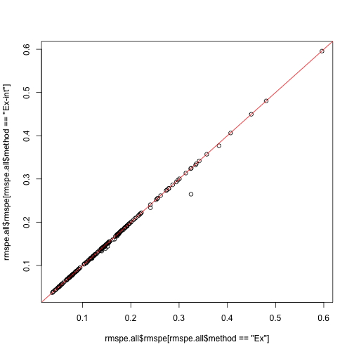
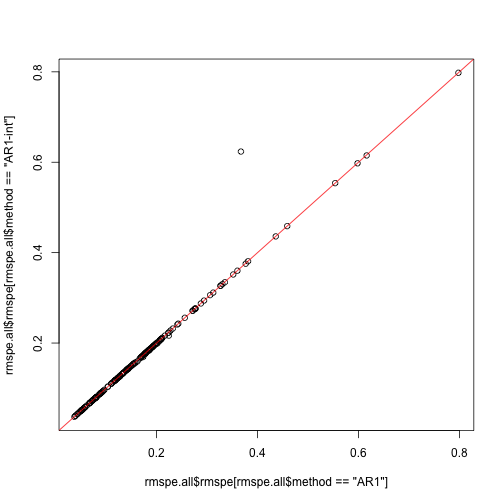
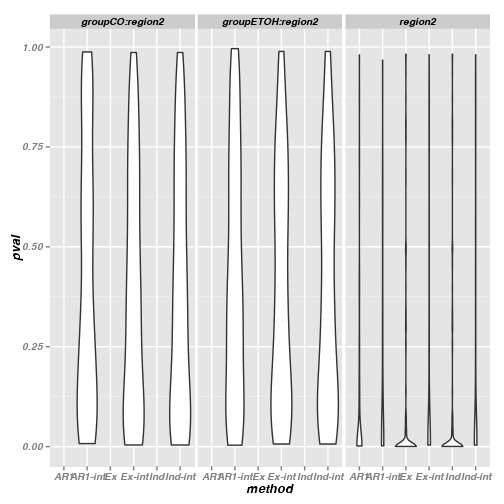

Calculate RMSPE, qvalues and compare with exons
===============================================

# Setup

## Libraries

<pre class="knitr r">## Load libraries
## Available from http://cran.r-project.org/web/packages/getopt/index.html
# install.packages("getopt")
library("getopt")

## Available from http://cran.at.r-project.org/web/packages/knitrBootstrap/index.html
# install.packages("knitrBootstrap")
library("knitrBootstrap")

# --- Specify any other libraries you need
# --- Not needed (since you load them in template.R), but good for the report
# --- Anyhow, just copying and pasting from template.R is good
# install.packages("cvTools")
library("cvTools")

# install.packages("geepack")
library("geepack")

# install.packages("ggplot2")
library("ggplot2")

# source("http://bioconductor.org/biocLite.R")
# biocLite("qvalue")
library("qvalue")
</pre>

## Directories

<pre class="knitr r">## Chr
chr <- paste0("chr", opt$chrnum)
chrnum <- as.numeric(opt$chrnum)

## Create dir to save files
if(opt$verbose) message("Creating directories")
</pre>

<pre class="knitr r">## Creating directories
</pre>

<pre class="knitr r">ddir <- file.path(opt$dirResult, opt$project, chr) # data directory (might change say if step2 uses the results from step2)
wdir <- file.path(opt$dirResult, opt$project, chr, opt$results) # working dir
dir.create(wdir, recursive=TRUE)
</pre>

<pre class="knitr r">## Warning:
## '/Users/lcollado/enigma2/756final_code/results/derHippo/chr22/rmspe'
## already exists
</pre>

<pre class="knitr r">
## Want to save some 'object'? Use:
# save(object, file=file.path(wdir, "object.Rdata"))
</pre>

# RMSPE

<pre class="knitr r">load(file.path(ddir, "geeAR1", "geeAR1.Rdata"))
load(file.path(ddir, "geeInd", "geeInd.Rdata"))
load(file.path(ddir, "geeEx", "geeEx.Rdata"))
</pre>

## Calculate the RMSPE

<pre class="knitr r">rmspe.all <- vector("list", length(geeAR1))
names(rmspe.all) <- names(geeAR1)

rmspe.all <- lapply(names(rmspe.all), function(x) {
	ar <- unlist(rmspe(y=geeAR1[[x]]$y, yHat=geeAR1[[x]]$fitted.values, includeSE=TRUE))
	ind <- unlist(rmspe(y=geeInd[[x]]$y, yHat=geeInd[[x]]$fitted.values, includeSE=TRUE))
	ex <- unlist(rmspe(y=geeEx[[x]]$y, yHat=geeEx[[x]]$fitted.values, includeSE=TRUE))
	df <- data.frame(rbind(ar, ind, ex))
	df$method <- factor(c("AR1", "Ind", "Ex"))
	df$cluster <- rep(as.integer(x), 3)
	rownames(df) <- NULL
	return(df)
})
rmspe.all <- do.call(rbind, rmspe.all)
save(rmspe.all, file=file.path(wdir, "rmspe.all.Rdata"))
</pre>

## Explore the results

<pre class="knitr r">ggplot(rmspe.all, aes(x=method, y=rmspe)) + geom_violin()
</pre>

<pre class="knitr r">ggplot(rmspe.all, aes(x=method, y=se)) + geom_violin()
</pre>

<pre class="knitr r">plot(rmspe.all$rmspe[rmspe.all$method=="Ind"], rmspe.all$rmspe[rmspe.all$method=="Ex"])
abline(0, 1, col="red")
</pre>

<pre class="knitr r">plot(rmspe.all$rmspe[rmspe.all$method=="Ind"], rmspe.all$rmspe[rmspe.all$method=="AR1"])
abline(0, 1, col="red")
</pre>

<pre class="knitr r">plot(rmspe.all$se[rmspe.all$method=="Ind"], rmspe.all$se[rmspe.all$method=="Ex"])
abline(0, 1, col="red")
</pre>

<pre class="knitr r">plot(rmspe.all$se[rmspe.all$method=="Ind"], rmspe.all$se[rmspe.all$method=="AR1"])
abline(0, 1, col="red")
</pre>

<pre class="knitr r">ggplot(subset(rmspe.all, method!="Ex"), aes(x=rmspe, y=se, color=method)) + geom_point()
</pre>

<pre class="knitr r">ggplot(subset(rmspe.all, method!="Ex"), aes(x=cluster, y=rmspe, color=method)) + geom_point()
</pre>

<pre class="knitr r">ggplot(subset(rmspe.all, method!="Ex"), aes(x=cluster, y=se, color=method)) + geom_point()
</pre>

<pre class="knitr r">tapply(rmspe.all$rmspe, rmspe.all$method, summary)
</pre>

<pre class="knitr r">## $AR1
##    Min. 1st Qu.  Median    Mean 3rd Qu.    Max. 
##  0.0372  0.0889  0.1450  0.1660  0.1980  0.7980 
## 
## $Ex
##    Min. 1st Qu.  Median    Mean 3rd Qu.    Max. 
##  0.0371  0.0868  0.1400  0.1550  0.1880  0.5960 
## 
## $Ind
##    Min. 1st Qu.  Median    Mean 3rd Qu.    Max. 
##  0.0371  0.0868  0.1400  0.1550  0.1880  0.5960
</pre>

<pre class="knitr r">tapply(rmspe.all$se, rmspe.all$method, summary)
</pre>

<pre class="knitr r">## $AR1
##     Min.  1st Qu.   Median     Mean  3rd Qu.     Max. 
## 0.000869 0.002760 0.004130 0.004670 0.005810 0.015200 
## 
## $Ex
##     Min.  1st Qu.   Median     Mean  3rd Qu.     Max. 
## 0.000877 0.002620 0.003990 0.004480 0.005510 0.015000 
## 
## $Ind
##     Min.  1st Qu.   Median     Mean  3rd Qu.     Max. 
## 0.000877 0.002620 0.003990 0.004480 0.005510 0.015000
</pre>

# Compare on exons

## Adjust q-values and perform tests

<pre class="knitr r">load(file.path(ddir, "geeAR1", "geeAR1.stat.Rdata"))
load(file.path(ddir, "geeInd", "geeInd.stat.Rdata"))
load(file.path(ddir, "geeEx", "geeEx.stat.Rdata"))

pvals <- vector("list", length(geeAR1))
names(pvals) <- names(geeAR1)

pvals <- lapply(names(pvals), function(x) {
	ar <- geeAR1.stat[[x]]$pval[1]
	ind <- geeInd.stat[[x]]$pval[1]
	ex <- geeEx.stat[[x]]$pval[1]
	df <- data.frame(pval=c(ar, ind, ex))
	df$method <- factor(c("AR1", "Ind", "Ex"))
	df$cluster <- rep(as.integer(x), 3)
	return(df)
})
pvals <- do.call(rbind, pvals)
qvals <- rep(NA, nrow(pvals))
for(i in c("AR1", "Ind", "Ex")) {
	qvals[pvals$method == i] <- qvalue(pvals$pval[pvals$method == i])$qvalues
}
pvals$qval <- qvals
pvals$pvalSig <- pvals$pval < 0.05
pvals$qvalSig <- pvals$qval < 0.10
save(pvals, file=file.path(wdir, "rmspe.all.Rdata"))
</pre>

<pre class="knitr r">summary(pvals)
</pre>

<pre class="knitr r">##       pval        method       cluster         qval        
##  Min.   :0.0000   AR1:187   Min.   :  9   Min.   :0.00000  
##  1st Qu.:0.0000   Ex :187   1st Qu.:189   1st Qu.:0.00000  
##  Median :0.0002   Ind:187   Median :301   Median :0.00007  
##  Mean   :0.1130             Mean   :302   Mean   :0.02623  
##  3rd Qu.:0.0653             3rd Qu.:414   3rd Qu.:0.01707  
##  Max.   :0.9829             Max.   :572   Max.   :0.21694  
##   pvalSig         qvalSig       
##  Mode :logical   Mode :logical  
##  FALSE:150       FALSE:64       
##  TRUE :411       TRUE :497      
##  NA's :0         NA's :0        
##                                 
## 
</pre>

<pre class="knitr r">ggplot(pvals, aes(x=method, y=pval)) + geom_violin()
</pre>

<pre class="knitr r">ggplot(pvals, aes(x=method, y=qval)) + geom_violin()
</pre>

<pre class="knitr r">plot(pvals$qval[pvals$method=="Ind"], pvals$qval[pvals$method=="Ex"])
abline(0, 1, col="red")
</pre>

<pre class="knitr r">plot(pvals$qval[pvals$method=="Ind"], pvals$qval[pvals$method=="AR1"])
abline(0, 1, col="red")
</pre>

<pre class="knitr r">ggplot(subset(pvals, method!="Ex"), aes(x=cluster, y=qval, colour=method)) + geom_point()
</pre>

# Region pairs and exons

<pre class="knitr r">load(file.path(ddir, "ov.Rdata"))

## Regions and exons: number of region pairs per exon
ov.df <- as.data.frame(ov.mat)
ex.tab <- table(ov.df$subjectHits[ ov.df$queryHits %in% unique(pvals$cluster)] )
ex.tab
</pre>

<pre class="knitr r">## 
##   79  136  140  177  182  204  331  340  423  912 1122 1208 1291 1292 1366 
##    1    3    1    1    1    1    1    2    1    1    1    1    1    4    2 
## 1367 1370 1373 1375 1406 1427 1695 1830 1888 1891 1921 1922 1923 1937 1942 
##    1    1    1    2    4    1    1    6    5    1    1    1    2    3    2 
## 1943 1945 1947 2004 2067 2078 2083 2092 2149 2225 2226 2227 2258 2298 2308 
##    2    2    1    4    5    1    1    9    1    1    1    1    1    2    2 
## 2309 2310 2313 2327 2337 2338 3043 3049 3264 3331 3404 3521 3745 3842 3936 
##    2    2    1    2    1    1    1    1    1    1    1    3    1    1    2 
## 3961 3963 4022 4027 4028 4329 4410 4414 4617 4661 4729 4752 4802 4803 4804 
##    5    1    2    1    3    1    2    1    3    1    2    1    1    3    2 
## 4806 4807 4808 4809 4813 4815 4824 4840 4853 4855 4857 4859 4861 4862 4878 
##    3    3    3    2    1    1    1    2    2    3    2    1    1    1    3 
## 4904 4911 4918 4924 
##    1    2    2    4
</pre>

<pre class="knitr r">## Exons with more than 1 region
idx.ex <- as.integer(names(ex.tab)[ ex.tab > 1])
ex.use <- ov.df[ ov.df$queryHits %in% unique(pvals$cluster) & ov.df$subjectHits %in% idx.ex, ]
save(ex.use, file=file.path(wdir, "ex.use.Rdata"))
head(ex.use)
</pre>

<pre class="knitr r">##    queryHits subjectHits
## 21        21         136
## 22        22         136
## 25        25         136
## 59        61         340
## 62        64         340
## 72        74        3521
</pre>

<pre class="knitr r">
## How many pairs were "linked"?
pvals.ex <- subset(pvals, cluster %in% ex.use$queryHits)
save(pvals.ex, file=file.path(wdir, "pvals.ex.Rdata"))
</pre>

<pre class="knitr r">ggplot(pvals.ex, aes(x=method, y=pval)) + geom_violin()
</pre>

<pre class="knitr r">ggplot(pvals.ex, aes(x=method, y=qval)) + geom_violin()
</pre>

<pre class="knitr r">
plot(pvals.ex$qval[pvals.ex$method=="Ind"], pvals.ex$qval[pvals.ex$method=="AR1"])
abline(0, 1, col="red")
</pre>

<pre class="knitr r">ggplot(subset(pvals.ex, method!="Ex"), aes(x=cluster, y=qval, colour=method)) + geom_point()
</pre>

<pre class="knitr r">
## Judging by p-value
tapply(pvals.ex$pvalSig, pvals.ex$method, summary)
</pre>

<pre class="knitr r">## $AR1
##    Mode   FALSE    TRUE    NA's 
## logical      45      80       0 
## 
## $Ex
##    Mode   FALSE    TRUE    NA's 
## logical      33      92       0 
## 
## $Ind
##    Mode   FALSE    TRUE    NA's 
## logical      33      92       0
</pre>

<pre class="knitr r">casesPval <- do.call(rbind, tapply(pvals.ex$pvalSig, pvals.ex$cluster, as.integer))
table(apply(casesPval, 1, paste, collapse="-"))
</pre>

<pre class="knitr r">## 
## 0-0-0 0-1-1 1-0-0 1-1-1 
##    20    25    13    67
</pre>

<pre class="knitr r">
## Judging by q-value
tapply(pvals.ex$qvalSig, pvals.ex$method, summary)
</pre>

<pre class="knitr r">## $AR1
##    Mode   FALSE    TRUE    NA's 
## logical      17     108       0 
## 
## $Ex
##    Mode   FALSE    TRUE    NA's 
## logical      17     108       0 
## 
## $Ind
##    Mode   FALSE    TRUE    NA's 
## logical      17     108       0
</pre>

<pre class="knitr r">casesQval <- do.call(rbind, tapply(pvals.ex$qvalSig, pvals.ex$cluster, as.integer))
table(apply(casesQval, 1, paste, collapse="-"))
</pre>

<pre class="knitr r">## 
## 0-0-0 0-1-1 1-0-0 1-1-1 
##     4    13    13    95
</pre>

# Reproducibility

Date the report was generated.

<pre class="knitr r">## [1] "2013-12-16 01:40:36 EST"
</pre>

Wallclock time spent generating the report.

<pre class="knitr r">## Time difference of 9.913 secs
</pre>

`R` session information.

<pre class="knitr r">## R version 3.0.2 (2013-09-25)
## Platform: x86_64-apple-darwin10.8.0 (64-bit)
## 
## locale:
## [1] en_US.UTF-8/en_US.UTF-8/en_US.UTF-8/C/en_US.UTF-8/en_US.UTF-8
## 
## attached base packages:
## [1] methods   stats     graphics  grDevices utils     datasets  base     
## 
## other attached packages:
## [1] qvalue_1.36.0        ggplot2_0.9.3.1      geepack_1.1-6       
## [4] cvTools_0.3.2        robustbase_0.9-10    lattice_0.20-24     
## [7] knitrBootstrap_0.9.0 getopt_1.20.0       
## 
## loaded via a namespace (and not attached):
##  [1] Cairo_1.5-3        colorspace_1.2-4   dichromat_2.0-0   
##  [4] digest_0.6.4       evaluate_0.5.1     formatR_0.10      
##  [7] grid_3.0.2         gtable_0.1.2       knitr_1.5         
## [10] labeling_0.2       markdown_0.6.3     MASS_7.3-29       
## [13] munsell_0.4.2      plyr_1.8           proto_0.3-10      
## [16] RColorBrewer_1.0-5 reshape2_1.2.2     scales_0.2.3      
## [19] stringr_0.6.2      tcltk_3.0.2        tools_3.0.2
</pre>

