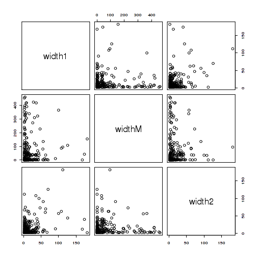
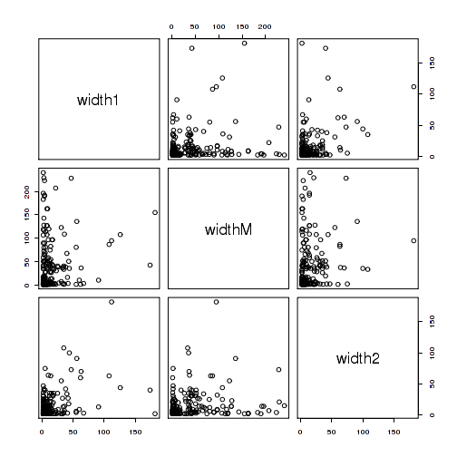

Run GEE with AR1 working correlation
===================================

# Setup

## Libraries

<pre class="knitr r">## Load libraries
## Available from http://cran.r-project.org/web/packages/getopt/index.html
# install.packages("getopt")
library("getopt")

## Available from http://cran.at.r-project.org/web/packages/knitrBootstrap/index.html
# install.packages("knitrBootstrap")
library("knitrBootstrap")

# --- Specify any other libraries you need
# --- Not needed (since you load them in template.R), but good for the report
# --- Anyhow, just copying and pasting from template.R is good
## gee
# install.packages("geepack")
library("geepack")

## for mclapply
library("parallel")
</pre>

## Directories

<pre class="knitr r">## Chr
chr <- paste0("chr", opt$chrnum)
chrnum <- as.numeric(opt$chrnum)

## Create dir to save files
if(opt$verbose) message("Creating directories")
</pre>

<pre class="knitr r">## Creating directories
</pre>

<pre class="knitr r">ddir <- file.path(opt$dirResult, opt$project, chr) # data directory (might change say if step2 uses the results from step2)
wdir <- file.path(opt$dirResult, opt$project, chr, opt$results) # working dir
dir.create(wdir, recursive=TRUE)
</pre>

<pre class="knitr r">## Warning:
## '/home/bst/student/lcollado/756final_code/results/derHippo/chr6/geeAR1'
## already exists
</pre>

<pre class="knitr r">
## Want to save some 'object'? Use:
# save(object, file=file.path(wdir, "object.Rdata"))
</pre>

# GEE AR1

<pre class="knitr r">## Load data
load(file.path(ddir, "covdata.Rdata"))
load(file.path(ddir, "pairs.Rdata"))

## How many region pairs are small?
nrow(subset(pairs, width1 > 1 & width2 > 1)) / nrow(pairs) * 100
</pre>

<pre class="knitr r">## [1] 41.35
</pre>

<pre class="knitr r">nrow(subset(pairs, width1 > 1 & widthM > 1 & width2 > 1)) / nrow(pairs) * 100
</pre>

<pre class="knitr r">## [1] 32.25
</pre>

<pre class="knitr r">nrow(subset(pairs, width1 > 2 & width2 > 2)) / nrow(pairs) * 100
</pre>

<pre class="knitr r">## [1] 25.73
</pre>

<pre class="knitr r">nrow(subset(pairs, width1 > 2 & widthM > 2 & width2 > 2)) / nrow(pairs) * 100
</pre>

<pre class="knitr r">## [1] 17.98
</pre>

<pre class="knitr r">
## Are some of them too long for GEE?
clen <- sapply(covdata, nrow)
summary(clen)
</pre>

<pre class="knitr r">##    Min. 1st Qu.  Median    Mean 3rd Qu.    Max. 
##      75     200     500    5180    2800   74600
</pre>

<pre class="knitr r">nrow(subset(pairs, widthM < 500)) / nrow(pairs) * 100
</pre>

<pre class="knitr r">## [1] 88.65
</pre>

<pre class="knitr r">nrow(subset(pairs, widthM < 250)) / nrow(pairs) * 100
</pre>

<pre class="knitr r">## [1] 83.71
</pre>

<pre class="knitr r">
## Choose a final index
nrow(subset(pairs, width1 > 1 & width2 > 1)) / nrow(pairs) * 100
</pre>

<pre class="knitr r">## [1] 41.35
</pre>

<pre class="knitr r">summary(subset(pairs, width1 > 1 & width2 > 1))
</pre>

<pre class="knitr r">##      start1              end1              startM        
##  Min.   :3.15e+06   Min.   :3.15e+06   Min.   :3.15e+06  
##  1st Qu.:3.32e+07   1st Qu.:3.32e+07   1st Qu.:3.32e+07  
##  Median :3.99e+07   Median :3.99e+07   Median :3.99e+07  
##  Mean   :6.28e+07   Mean   :6.28e+07   Mean   :6.28e+07  
##  3rd Qu.:1.08e+08   3rd Qu.:1.08e+08   3rd Qu.:1.08e+08  
##  Max.   :1.71e+08   Max.   :1.71e+08   Max.   :1.71e+08  
##       endM              start2              end2             cluster     
##  Min.   :3.15e+06   Min.   :3.15e+06   Min.   :3.15e+06   Min.   :  2.0  
##  1st Qu.:3.32e+07   1st Qu.:3.32e+07   1st Qu.:3.32e+07   1st Qu.: 80.5  
##  Median :3.99e+07   Median :3.99e+07   Median :3.99e+07   Median :114.0  
##  Mean   :6.28e+07   Mean   :6.28e+07   Mean   :6.28e+07   Mean   :130.5  
##  3rd Qu.:1.08e+08   3rd Qu.:1.08e+08   3rd Qu.:1.08e+08   3rd Qu.:191.0  
##  Max.   :1.71e+08   Max.   :1.71e+08   Max.   :1.71e+08   Max.   :301.0  
##      width1          widthM           width2         widthNoM    
##  Min.   :  2.0   Min.   :   1.0   Min.   :  2.0   Min.   :  4.0  
##  1st Qu.:  3.0   1st Qu.:   2.0   1st Qu.:  3.0   1st Qu.:  8.0  
##  Median :  6.0   Median :   7.5   Median :  5.0   Median : 14.0  
##  Mean   : 13.7   Mean   : 202.2   Mean   : 12.4   Mean   : 26.1  
##  3rd Qu.: 14.0   3rd Qu.: 108.0   3rd Qu.: 13.2   3rd Qu.: 30.2  
##  Max.   :182.0   Max.   :2920.0   Max.   :182.0   Max.   :294.0
</pre>

<pre class="knitr r">with(subset(pairs, width1 > 1 & width2 > 1), pairs(~width1 + widthM + width2))
</pre>

<pre class="knitr r">
nrow(subset(pairs, width1 > 1 & widthM < 500 & width2 > 1)) / nrow(pairs) * 100
</pre>

<pre class="knitr r">## [1] 36.4
</pre>

<pre class="knitr r">summary(subset(pairs, width1 > 1 & widthM < 500 & width2 > 1))
</pre>

<pre class="knitr r">##      start1              end1              startM        
##  Min.   :3.15e+06   Min.   :3.15e+06   Min.   :3.15e+06  
##  1st Qu.:3.32e+07   1st Qu.:3.32e+07   1st Qu.:3.32e+07  
##  Median :3.99e+07   Median :3.99e+07   Median :3.99e+07  
##  Mean   :6.25e+07   Mean   :6.25e+07   Mean   :6.25e+07  
##  3rd Qu.:1.08e+08   3rd Qu.:1.08e+08   3rd Qu.:1.08e+08  
##  Max.   :1.71e+08   Max.   :1.71e+08   Max.   :1.71e+08  
##       endM              start2              end2             cluster   
##  Min.   :3.15e+06   Min.   :3.15e+06   Min.   :3.15e+06   Min.   :  2  
##  1st Qu.:3.32e+07   1st Qu.:3.32e+07   1st Qu.:3.32e+07   1st Qu.: 82  
##  Median :3.99e+07   Median :3.99e+07   Median :3.99e+07   Median :114  
##  Mean   :6.25e+07   Mean   :6.25e+07   Mean   :6.25e+07   Mean   :130  
##  3rd Qu.:1.08e+08   3rd Qu.:1.08e+08   3rd Qu.:1.08e+08   3rd Qu.:190  
##  Max.   :1.71e+08   Max.   :1.71e+08   Max.   :1.71e+08   Max.   :301  
##      width1          widthM          width2         widthNoM    
##  Min.   :  2.0   Min.   :  1.0   Min.   :  2.0   Min.   :  4.0  
##  1st Qu.:  3.0   1st Qu.:  1.8   1st Qu.:  3.0   1st Qu.:  8.0  
##  Median :  6.0   Median :  4.0   Median :  5.0   Median : 14.0  
##  Mean   : 13.9   Mean   : 51.5   Mean   : 13.1   Mean   : 27.0  
##  3rd Qu.: 14.0   3rd Qu.: 44.2   3rd Qu.: 14.0   3rd Qu.: 30.2  
##  Max.   :182.0   Max.   :462.0   Max.   :182.0   Max.   :294.0
</pre>

<pre class="knitr r">with(subset(pairs, width1 > 1 & widthM < 500 & width2 > 1), pairs(~width1 + widthM + width2))
</pre>

<pre class="knitr r">
nrow(subset(pairs, width1 > 1 & widthM < 250 & width2 > 1)) / nrow(pairs) * 100
</pre>

<pre class="knitr r">## [1] 33.71
</pre>

<pre class="knitr r">summary(subset(pairs, width1 > 1 & widthM < 250 & width2 > 1))
</pre>

<pre class="knitr r">##      start1              end1              startM        
##  Min.   :3.15e+06   Min.   :3.15e+06   Min.   :3.15e+06  
##  1st Qu.:3.32e+07   1st Qu.:3.32e+07   1st Qu.:3.32e+07  
##  Median :4.08e+07   Median :4.08e+07   Median :4.08e+07  
##  Mean   :6.27e+07   Mean   :6.27e+07   Mean   :6.27e+07  
##  3rd Qu.:1.08e+08   3rd Qu.:1.08e+08   3rd Qu.:1.08e+08  
##  Max.   :1.71e+08   Max.   :1.71e+08   Max.   :1.71e+08  
##       endM              start2              end2             cluster   
##  Min.   :3.15e+06   Min.   :3.15e+06   Min.   :3.15e+06   Min.   :  2  
##  1st Qu.:3.32e+07   1st Qu.:3.32e+07   1st Qu.:3.32e+07   1st Qu.: 82  
##  Median :4.08e+07   Median :4.08e+07   Median :4.08e+07   Median :115  
##  Mean   :6.27e+07   Mean   :6.27e+07   Mean   :6.27e+07   Mean   :130  
##  3rd Qu.:1.08e+08   3rd Qu.:1.08e+08   3rd Qu.:1.08e+08   3rd Qu.:190  
##  Max.   :1.71e+08   Max.   :1.71e+08   Max.   :1.71e+08   Max.   :301  
##      width1          widthM          width2         widthNoM    
##  Min.   :  2.0   Min.   :  1.0   Min.   :  2.0   Min.   :  4.0  
##  1st Qu.:  3.0   1st Qu.:  1.0   1st Qu.:  3.0   1st Qu.:  8.0  
##  Median :  6.0   Median :  4.0   Median :  5.0   Median : 14.0  
##  Mean   : 13.8   Mean   : 26.9   Mean   : 13.3   Mean   : 27.1  
##  3rd Qu.: 14.0   3rd Qu.: 36.0   3rd Qu.: 14.0   3rd Qu.: 30.0  
##  Max.   :182.0   Max.   :240.0   Max.   :182.0   Max.   :294.0
</pre>

<pre class="knitr r">with(subset(pairs, width1 > 1 & widthM > 1 & widthM < 250 & width2 > 1), pairs(~width1 + widthM + width2))
</pre>

<pre class="knitr r">
## Use regions with width1 > 1, width2 > 1 and widthM < 250
pairs.use <- with(pairs, which(width1 > 1 & widthM < 250 & width2 > 1))

## Subset data set
covdata.used <- covdata[pairs.use]
names(covdata.used) <- pairs.use
pairs.used <- pairs[pairs.use, ]

## Save subsets
save(covdata.used, file=file.path(wdir, "covdata.used.Rdata"))
save(pairs.used, file=file.path(wdir, "pairs.used.Rdata"))

## Run GEE
idx <- seq_len(length(covdata.used))
## testing:
#idx <- 1:2
myGEE <- function(i, corstr) {
	geeglm(coverage ~ sampleDepth + group + region, id = sample, data = covdata.used[[i]], family = gaussian, corstr = corstr)
}
myGEE.int <- function(i, corstr) {
	geeglm(coverage ~ sampleDepth + group * region, id = sample, data = covdata.used[[i]], family = gaussian, corstr = corstr)
}

## GEE AR1
if(opt$verbose) message(paste(Sys.time(), "running GEE with AR1"))
</pre>

<pre class="knitr r">## 2013-12-20 10:21:54 running GEE with AR1
</pre>

<pre class="knitr r">geeAR1 <- mclapply(idx, myGEE, corstr="ar1", mc.cores=20)
names(geeAR1) <- names(covdata.used)[idx]
save(geeAR1, file=file.path(wdir, "geeAR1.Rdata"))

## GEE AR1 - int
if(opt$verbose) message(paste(Sys.time(), "running GEE with AR1 - interaction"))
</pre>

<pre class="knitr r">## 2013-12-20 10:25:43 running GEE with AR1 - interaction
</pre>

<pre class="knitr r">geeAR1.int <- mclapply(idx, myGEE.int, corstr="ar1", mc.cores=20)
names(geeAR1.int) <- names(covdata.used)[idx]
save(geeAR1.int, file=file.path(wdir, "geeAR1.int.Rdata"))

## Show an example:
geeAR1[[1]]
</pre>

<pre class="knitr r">## 
## Call:
## geeglm(formula = coverage ~ sampleDepth + group + region, family = gaussian, 
##     data = covdata.used[[i]], id = sample, corstr = corstr)
## 
## Coefficients:
##   (Intercept)   sampleDepth       groupCO     groupETOH regionregionM 
##      -5.27214       0.40678      -0.79260      -0.48633       0.04106 
## regionregion2 
##       0.07207 
## 
## Degrees of Freedom: 3525 Total (i.e. Null);  3519 Residual
## 
## Scale Link:                   identity
## Estimated Scale Parameters:  [1] 0.1797
## 
## Correlation:  Structure = ar1    Link = identity 
## Estimated Correlation Parameters:
##  alpha 
## 0.9785 
## 
## Number of clusters:   25   Maximum cluster size: 141
</pre>

<pre class="knitr r">summary(geeAR1[[1]])
</pre>

<pre class="knitr r">## 
## Call:
## geeglm(formula = coverage ~ sampleDepth + group + region, family = gaussian, 
##     data = covdata.used[[i]], id = sample, corstr = corstr)
## 
##  Coefficients:
##               Estimate  Std.err  Wald Pr(>|W|)    
## (Intercept)   -5.27214  3.28154  2.58  0.10814    
## sampleDepth    0.40678  0.11585 12.33  0.00045 ***
## groupCO       -0.79260  0.14525 29.78  4.8e-08 ***
## groupETOH     -0.48633  0.14281 11.60  0.00066 ***
## regionregionM  0.04106  0.00692 35.24  2.9e-09 ***
## regionregion2  0.07207  0.00901 63.94  1.3e-15 ***
## ---
## Signif. codes:  0 '***' 0.001 '**' 0.01 '*' 0.05 '.' 0.1 ' ' 1
## 
## Estimated Scale Parameters:
##             Estimate Std.err
## (Intercept)     0.18  0.0309
## 
## Correlation: Structure = ar1  Link = identity 
## 
## Estimated Correlation Parameters:
##       Estimate Std.err
## alpha    0.979 0.00477
## Number of clusters:   25   Maximum cluster size: 141
</pre>

<pre class="knitr r">geeAR1.int[[1]]
</pre>

<pre class="knitr r">## 
## Call:
## geeglm(formula = coverage ~ sampleDepth + group * region, family = gaussian, 
##     data = covdata.used[[i]], id = sample, corstr = corstr)
## 
## Coefficients:
##             (Intercept)             sampleDepth                 groupCO 
##                -5.28438                 0.40679                -0.76827 
##               groupETOH           regionregionM           regionregion2 
##                -0.47566                 0.05304                 0.09359 
##   groupCO:regionregionM groupETOH:regionregionM   groupCO:regionregion2 
##                -0.02495                -0.00946                -0.04178 
## groupETOH:regionregion2 
##                -0.02051 
## 
## Degrees of Freedom: 3525 Total (i.e. Null);  3515 Residual
## 
## Scale Link:                   identity
## Estimated Scale Parameters:  [1] 0.179
## 
## Correlation:  Structure = ar1    Link = identity 
## Estimated Correlation Parameters:
## alpha 
## 0.979 
## 
## Number of clusters:   25   Maximum cluster size: 141
</pre>

<pre class="knitr r">summary(geeAR1.int[[1]])
</pre>

<pre class="knitr r">## 
## Call:
## geeglm(formula = coverage ~ sampleDepth + group * region, family = gaussian, 
##     data = covdata.used[[i]], id = sample, corstr = corstr)
## 
##  Coefficients:
##                         Estimate  Std.err  Wald Pr(>|W|)    
## (Intercept)             -5.28438  3.28335  2.59  0.10752    
## sampleDepth              0.40679  0.11584 12.33  0.00045 ***
## groupCO                 -0.76827  0.13802 30.98  2.6e-08 ***
## groupETOH               -0.47566  0.13649 12.14  0.00049 ***
## regionregionM            0.05304  0.01308 16.44  5.0e-05 ***
## regionregion2            0.09359  0.01197 61.14  5.3e-15 ***
## groupCO:regionregionM   -0.02495  0.01621  2.37  0.12375    
## groupETOH:regionregionM -0.00946  0.01757  0.29  0.59014    
## groupCO:regionregion2   -0.04178  0.01969  4.50  0.03383 *  
## groupETOH:regionregion2 -0.02051  0.01918  1.14  0.28489    
## ---
## Signif. codes:  0 '***' 0.001 '**' 0.01 '*' 0.05 '.' 0.1 ' ' 1
## 
## Estimated Scale Parameters:
##             Estimate Std.err
## (Intercept)    0.179  0.0309
## 
## Correlation: Structure = ar1  Link = identity 
## 
## Estimated Correlation Parameters:
##       Estimate Std.err
## alpha    0.979 0.00478
## Number of clusters:   25   Maximum cluster size: 141
</pre>

<pre class="knitr r">
## Extract region2 coef estimate, st.error, and Wald stat
myGEE.stat <- function(y) {
	beta <- c(coef(y)["regionregion2"], y$geese$gamma, y$geese$alpha)
	## Assumes that geeglm(std.err="san.se") which is the default value
	vbeta <- sqrt(c(y$geese$vbeta[6, 6], y$geese$gamma, y$geese$valpha))
	wald <- (beta/vbeta)^2
	pval <- 1 - pchisq(wald, df=1)
	df <- data.frame(coef=c("region2", "gamma", "alpha"), estimate=beta, stderr=vbeta, wald=wald, pval=pval)
	rownames(df) <- seq_len(nrow(df))
	return(df)
}
geeAR1.stat <- lapply(geeAR1, myGEE.stat)
save(geeAR1.stat, file=file.path(wdir, "geeAR1.stat.Rdata"))

## Extract region2 coef estimate, interaction coef estiamtes, st.error, and Wald stat
myGEE.int.stat <- function(y) {
	beta <- c(coef(y)[c("regionregion2", "groupCO:regionregion2", "groupETOH:regionregion2")], y$geese$gamma, y$geese$alpha)
	## Assumes that geeglm(std.err="san.se") which is the default value
	vbeta <- sqrt(c(y$geese$vbeta[6, 6], y$geese$vbeta[9, 9], y$geese$vbeta[10, 10], y$geese$vgamma, y$geese$valpha))
	wald <- (beta/vbeta)^2
	pval <- 1 - pchisq(wald, df=1)
	df <- data.frame(coef=c("region2", "groupCO:region2", "groupETOH:region2", "gamma", "alpha"), estimate=beta, stderr=vbeta, wald=wald, pval=pval)
	rownames(df) <- seq_len(nrow(df))
	return(df)
}

geeAR1.int.stat <- lapply(geeAR1.int, myGEE.int.stat)
save(geeAR1.int.stat, file=file.path(wdir, "geeAR1.int.stat.Rdata"))

## Show an example:
geeAR1.stat[[1]]
</pre>

<pre class="knitr r">##      coef estimate  stderr     wald     pval
## 1 region2   0.0721 0.00901    63.94 1.33e-15
## 2   gamma   0.1797 0.42386     0.18 6.72e-01
## 3   alpha   0.9785 0.00477 42165.71 0.00e+00
</pre>

<pre class="knitr r">geeAR1.int.stat[[1]]
</pre>

<pre class="knitr r">##                coef estimate  stderr     wald     pval
## 1           region2   0.0936 0.01197    61.14 5.33e-15
## 2   groupCO:region2  -0.0418 0.01969     4.50 3.38e-02
## 3 groupETOH:region2  -0.0205 0.01918     1.14 2.85e-01
## 4             gamma   0.1793 0.03091    33.64 6.63e-09
## 5             alpha   0.9786 0.00478 41849.87 0.00e+00
</pre>

# Reproducibility

Date the report was generated.

<pre class="knitr r">## [1] "2013-12-20 10:29:32 EST"
</pre>

Wallclock time spent generating the report.

<pre class="knitr r">## Time difference of 7.67 mins
</pre>

`R` session information.

<pre class="knitr r">## R version 3.0.2 Patched (2013-10-17 r64066)
## Platform: x86_64-unknown-linux-gnu (64-bit)
## 
## locale:
##  [1] LC_CTYPE=en_US.iso885915       LC_NUMERIC=C                  
##  [3] LC_TIME=en_US.iso885915        LC_COLLATE=en_US.iso885915    
##  [5] LC_MONETARY=en_US.iso885915    LC_MESSAGES=en_US.iso885915   
##  [7] LC_PAPER=en_US.iso885915       LC_NAME=C                     
##  [9] LC_ADDRESS=C                   LC_TELEPHONE=C                
## [11] LC_MEASUREMENT=en_US.iso885915 LC_IDENTIFICATION=C           
## 
## attached base packages:
## [1] parallel  stats     graphics  grDevices utils     datasets  base     
## 
## other attached packages:
## [1] geepack_1.1-6        knitrBootstrap_0.9.0 getopt_1.20.0       
## 
## loaded via a namespace (and not attached):
## [1] Cairo_1.5-4    evaluate_0.5.1 formatR_0.10   knitr_1.5     
## [5] markdown_0.6.3 stringr_0.6.2  tools_3.0.2
</pre>

