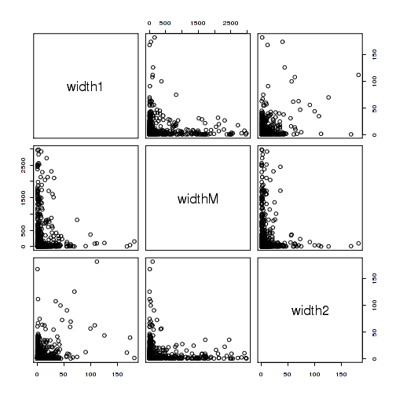

Pre-processing report
=====================

# Setup

## Libraries

<pre class="knitr r">## Load libraries

## Available from http://cran.r-project.org/web/packages/getopt/index.html
# install.packages("getopt")
library("getopt")

## Available from http://cran.at.r-project.org/web/packages/knitrBootstrap/index.html
# install.packages("knitrBootstrap")
library("knitrBootstrap")

## Available from http://cran.at.r-project.org/web/packages/reshape2/index.html
# install.packages("reshape2")
library("reshape2")

## Available from http://www.bioconductor.org/packages/release/bioc/html/GenomicRanges.html
# source("http://bioconductor.org/biocLite.R")
# biocLite("GenomicRanges")
library("GenomicRanges")

## Available from http://cran.at.r-project.org/web/packages/gee/index.html
# install.packages("gee")
library("gee")

## Available from https://github.com/lcolladotor/derfinder
## Read README.md for installation instructions
# install.packages(devtools)
# library(devtools)
# install_github("derfinder", "lcolladotor")
library("derfinder")

## Available from http://www.bioconductor.org/packages/release/bioc/html/TxDb.Hsapiens.UCSC.hg19.knownGene.html
# source("http://bioconductor.org/biocLite.R")
# biocLite("TxDb.Hsapiens.UCSC.hg19.knownGene")
suppressMessages(library("TxDb.Hsapiens.UCSC.hg19.knownGene"))
</pre>

## Directories

<pre class="knitr r">## Chr
chr <- paste0("chr", opt$chrnum)
chrnum <- as.numeric(opt$chrnum)

## Create dir to save files
if(opt$verbose) message("Creating directories")
</pre>

<pre class="knitr r">## Creating directories
</pre>

<pre class="knitr r">wdir <- file.path(opt$dirResult, opt$project, chr) # working dir
rawdir <- file.path(wdir, "raw")
dir.create(wdir, recursive=TRUE)
</pre>

<pre class="knitr r">## Warning: '/home/bst/student/lcollado/756final_code/results/derHippo/chr6'
## already exists
</pre>

<pre class="knitr r">dir.create(rawdir, recursive=TRUE)

## Shortcuts for previous directories
pdir <- file.path("/dcs01/lieber/ajaffe/Brain/derRuns", opt$project) ## original project dir
rdir <- file.path(pdir, "derAnalysis", opt$run) ## original project-run dir
cdir <- file.path(rdir, chr) # original project-run-chr dir

## Dirs:
dirs <- c(wdir=wdir, rawdir=rawdir, pdir=pdir, rdir=rdir, cdir=cdir)
save(dirs, file=file.path(wdir, "dirs.Rdata"))
dirs
</pre>

<pre class="knitr r">##                                                                        wdir 
##            "/home/bst/student/lcollado/756final_code/results/derHippo/chr6" 
##                                                                      rawdir 
##        "/home/bst/student/lcollado/756final_code/results/derHippo/chr6/raw" 
##                                                                        pdir 
##                               "/dcs01/lieber/ajaffe/Brain/derRuns/derHippo" 
##                                                                        rdir 
##      "/dcs01/lieber/ajaffe/Brain/derRuns/derHippo/derAnalysis/run1-v0.0.42" 
##                                                                        cdir 
## "/dcs01/lieber/ajaffe/Brain/derRuns/derHippo/derAnalysis/run1-v0.0.42/chr6"
</pre>

# Pre-processing

## Copying original files

<pre class="knitr r">## Copy raw files
if(opt$verbose) message("Copying raw files")
</pre>

<pre class="knitr r">## Copying raw files
</pre>

<pre class="knitr r">	
## Project-specific files
file.copy(file.path(rdir, "sampleDepths.Rdata"), rawdir)
</pre>

<pre class="knitr r">## [1] TRUE
</pre>

<pre class="knitr r">if(file.exists(file.path(rdir, "colsubset.Rdata"))) {
	file.copy(file.path(rdir, "colsubset.Rdata"), rawdir)
}
</pre>

<pre class="knitr r">## [1] TRUE
</pre>

<pre class="knitr r">
## Chr-specific files
file.copy(file.path(cdir, "annotation.Rdata"), rawdir)
</pre>

<pre class="knitr r">## [1] TRUE
</pre>

<pre class="knitr r">file.copy(file.path(cdir, "regions.Rdata"), rawdir)
</pre>

<pre class="knitr r">## [1] TRUE
</pre>

<pre class="knitr r">file.copy(file.path(cdir, "optionsStats.Rdata"), rawdir)
</pre>

<pre class="knitr r">## [1] TRUE
</pre>

## Identify pairs

<pre class="knitr r">## Identify pairs
if(opt$verbose) message("Identifying pairs")
</pre>

<pre class="knitr r">## Identifying pairs
</pre>

<pre class="knitr r">
## Load original regions
load(file.path(rawdir, "regions.Rdata"))
## Keep only the region info
regions <- regions$regions
## Order by cluster (determine by optionsStats$maxRegionGap)
regions <- regions[order(regions$cluster), ]

## Assign chr length info
data(hg19Ideogram, package = "biovizBase", envir = environment())
seqlengths(regions) <- seqlengths(hg19Ideogram)[names(seqlengths(regions))]

## Save regions
save(regions, file=file.path(wdir, "regions.Rdata"))

## Identify clusters that have 2 or more regions: aka, have at least a pair
p.idx <- which(runLength(regions$cluster) > 1)
## Number of pairs
p.n <- sum(runLength(regions$cluster)[p.idx] - 1)
if(p.n == 0) stop("No pairs found")

regsub <- regions[ regions$cluster %in% p.idx]
save(regsub, file=file.path(wdir, "regsub.Rdata"))

na <- rep(NA, p.n)
pairs <- data.frame(start1=na, end1=na, startM=na, endM=na, start2=na, end2=na, cluster=na)
i <- 0
for(j in unique(regsub$cluster)) {
	if(opt$verbose) message(paste("Processing region cluster", j))
	## Subset
	cluster <- regsub[regsub$cluster == j]
	## Order by chr position
	cluster <- cluster[order(start(cluster))]
	for(k in seq_len(length(cluster) - 1)) {
		i <- i + 1
		current <- cluster[k:(k+1)]
		pairs[i, ] <- c(start1=start(current[1]), end1=end(current[1]), startM=end(current[1])+1, endM=start(current[2])-1, start2=start(current[2]), end2=end(current[2]), cluster=j)
	}
}
</pre>

<pre class="knitr r">## Processing region cluster 2
## Processing region cluster 3
## Processing region cluster 4
## Processing region cluster 6
## Processing region cluster 7
## Processing region cluster 8
## Processing region cluster 12
## Processing region cluster 16
## Processing region cluster 18
## Processing region cluster 19
## Processing region cluster 20
## Processing region cluster 22
## Processing region cluster 23
## Processing region cluster 25
## Processing region cluster 26
## Processing region cluster 27
## Processing region cluster 29
## Processing region cluster 30
## Processing region cluster 31
## Processing region cluster 32
## Processing region cluster 33
## Processing region cluster 35
## Processing region cluster 37
## Processing region cluster 40
## Processing region cluster 42
## Processing region cluster 44
## Processing region cluster 45
## Processing region cluster 48
## Processing region cluster 49
## Processing region cluster 51
## Processing region cluster 52
## Processing region cluster 53
## Processing region cluster 55
## Processing region cluster 56
## Processing region cluster 57
## Processing region cluster 58
## Processing region cluster 59
## Processing region cluster 60
## Processing region cluster 61
## Processing region cluster 63
## Processing region cluster 64
## Processing region cluster 65
## Processing region cluster 66
## Processing region cluster 69
## Processing region cluster 70
## Processing region cluster 71
## Processing region cluster 72
## Processing region cluster 73
## Processing region cluster 74
## Processing region cluster 75
## Processing region cluster 76
## Processing region cluster 80
## Processing region cluster 81
## Processing region cluster 82
## Processing region cluster 83
## Processing region cluster 84
## Processing region cluster 85
## Processing region cluster 86
## Processing region cluster 87
## Processing region cluster 88
## Processing region cluster 89
## Processing region cluster 90
## Processing region cluster 91
## Processing region cluster 92
## Processing region cluster 93
## Processing region cluster 94
## Processing region cluster 96
## Processing region cluster 97
## Processing region cluster 99
## Processing region cluster 100
## Processing region cluster 101
## Processing region cluster 102
## Processing region cluster 103
## Processing region cluster 105
## Processing region cluster 109
## Processing region cluster 111
## Processing region cluster 112
## Processing region cluster 113
## Processing region cluster 114
## Processing region cluster 115
## Processing region cluster 116
## Processing region cluster 117
## Processing region cluster 118
## Processing region cluster 119
## Processing region cluster 120
## Processing region cluster 122
## Processing region cluster 123
## Processing region cluster 124
## Processing region cluster 126
## Processing region cluster 127
## Processing region cluster 130
## Processing region cluster 131
## Processing region cluster 134
## Processing region cluster 135
## Processing region cluster 138
## Processing region cluster 139
## Processing region cluster 140
## Processing region cluster 141
## Processing region cluster 142
## Processing region cluster 143
## Processing region cluster 144
## Processing region cluster 145
## Processing region cluster 146
## Processing region cluster 149
## Processing region cluster 151
## Processing region cluster 155
## Processing region cluster 156
## Processing region cluster 162
## Processing region cluster 163
## Processing region cluster 168
## Processing region cluster 169
## Processing region cluster 170
## Processing region cluster 172
## Processing region cluster 174
## Processing region cluster 176
## Processing region cluster 178
## Processing region cluster 179
## Processing region cluster 181
## Processing region cluster 183
## Processing region cluster 186
## Processing region cluster 188
## Processing region cluster 189
## Processing region cluster 191
## Processing region cluster 193
## Processing region cluster 194
## Processing region cluster 195
## Processing region cluster 197
## Processing region cluster 198
## Processing region cluster 200
## Processing region cluster 201
## Processing region cluster 203
## Processing region cluster 204
## Processing region cluster 205
## Processing region cluster 207
## Processing region cluster 208
## Processing region cluster 209
## Processing region cluster 211
## Processing region cluster 213
## Processing region cluster 214
## Processing region cluster 216
## Processing region cluster 217
## Processing region cluster 219
## Processing region cluster 221
## Processing region cluster 222
## Processing region cluster 223
## Processing region cluster 224
## Processing region cluster 226
## Processing region cluster 227
## Processing region cluster 228
## Processing region cluster 229
## Processing region cluster 230
## Processing region cluster 231
## Processing region cluster 232
## Processing region cluster 235
## Processing region cluster 238
## Processing region cluster 239
## Processing region cluster 241
## Processing region cluster 242
## Processing region cluster 244
## Processing region cluster 245
## Processing region cluster 247
## Processing region cluster 249
## Processing region cluster 252
## Processing region cluster 253
## Processing region cluster 259
## Processing region cluster 260
## Processing region cluster 261
## Processing region cluster 263
## Processing region cluster 265
## Processing region cluster 266
## Processing region cluster 268
## Processing region cluster 272
## Processing region cluster 273
## Processing region cluster 278
## Processing region cluster 279
## Processing region cluster 280
## Processing region cluster 281
## Processing region cluster 282
## Processing region cluster 283
## Processing region cluster 284
## Processing region cluster 285
## Processing region cluster 286
## Processing region cluster 288
## Processing region cluster 290
## Processing region cluster 293
## Processing region cluster 294
## Processing region cluster 296
## Processing region cluster 297
## Processing region cluster 299
## Processing region cluster 300
## Processing region cluster 301
</pre>

<pre class="knitr r">pairs$width1 <- pairs$end1 - pairs$start1 + 1
pairs$widthM <- pairs$endM - pairs$startM + 1
pairs$width2 <- pairs$end2 - pairs$start2 + 1
pairs$widthNoM <- pairs$width1 + pairs$width2

## Save pairs info
save(pairs, file=file.path(wdir, "pairs.Rdata"))
</pre>

### Basic pairs exploration

<pre class="knitr r">dim(pairs)
</pre>

<pre class="knitr r">## [1] 890  11
</pre>

<pre class="knitr r">summary(pairs)
</pre>

<pre class="knitr r">##      start1              end1              startM        
##  Min.   :3.15e+06   Min.   :3.15e+06   Min.   :3.15e+06  
##  1st Qu.:3.29e+07   1st Qu.:3.29e+07   1st Qu.:3.29e+07  
##  Median :4.24e+07   Median :4.24e+07   Median :4.24e+07  
##  Mean   :6.63e+07   Mean   :6.63e+07   Mean   :6.63e+07  
##  3rd Qu.:1.11e+08   3rd Qu.:1.11e+08   3rd Qu.:1.11e+08  
##  Max.   :1.71e+08   Max.   :1.71e+08   Max.   :1.71e+08  
##       endM              start2              end2             cluster   
##  Min.   :3.15e+06   Min.   :3.15e+06   Min.   :3.15e+06   Min.   :  2  
##  1st Qu.:3.29e+07   1st Qu.:3.29e+07   1st Qu.:3.29e+07   1st Qu.: 76  
##  Median :4.24e+07   Median :4.24e+07   Median :4.24e+07   Median :118  
##  Mean   :6.63e+07   Mean   :6.63e+07   Mean   :6.63e+07   Mean   :135  
##  3rd Qu.:1.11e+08   3rd Qu.:1.11e+08   3rd Qu.:1.11e+08   3rd Qu.:198  
##  Max.   :1.71e+08   Max.   :1.71e+08   Max.   :1.71e+08   Max.   :301  
##      width1           widthM           width2          widthNoM    
##  Min.   :  1.00   Min.   :   1.0   Min.   :  1.00   Min.   :  2.0  
##  1st Qu.:  1.00   1st Qu.:   1.0   1st Qu.:  1.00   1st Qu.:  3.0  
##  Median :  2.00   Median :   5.0   Median :  2.00   Median :  7.0  
##  Mean   :  7.93   Mean   : 191.8   Mean   :  7.65   Mean   : 15.6  
##  3rd Qu.:  7.00   3rd Qu.:  83.8   3rd Qu.:  7.00   3rd Qu.: 17.0  
##  Max.   :182.00   Max.   :2982.0   Max.   :182.00   Max.   :294.0
</pre>

<pre class="knitr r">with(pairs, pairs(~width1 + widthM + width2))
</pre>

<pre class="knitr r">with(pairs, pairs(~widthM + widthNoM))
</pre>

<pre class="knitr r">
## How many pairs seem 'long' enough? In percent
nrow(subset(pairs, width1 > 10 & width2 > 10)) / nrow(pairs) * 100
</pre>

<pre class="knitr r">## [1] 5.618
</pre>

<pre class="knitr r">nrow(subset(pairs, width1 > 10 & widthM > 10 & width2 > 10)) / nrow(pairs) * 100
</pre>

<pre class="knitr r">## [1] 4.27
</pre>

<pre class="knitr r">nrow(subset(pairs, width1 > 20 & width2 > 20)) / nrow(pairs) * 100
</pre>

<pre class="knitr r">## [1] 2.36
</pre>

<pre class="knitr r">nrow(subset(pairs, width1 > 20 & widthM > 20 & width2 > 20)) / nrow(pairs) * 100
</pre>

<pre class="knitr r">## [1] 1.91
</pre>

<pre class="knitr r">nrow(subset(pairs, width1 > 50 & width2 > 50)) / nrow(pairs) * 100
</pre>

<pre class="knitr r">## [1] 0.7865
</pre>

<pre class="knitr r">nrow(subset(pairs, width1 > 50 & widthM > 50 & width2 > 50)) / nrow(pairs) * 100
</pre>

<pre class="knitr r">## [1] 0.4494
</pre>

<pre class="knitr r">nrow(subset(pairs, width1 > 100 & width2 > 100)) / nrow(pairs) * 100
</pre>

<pre class="knitr r">## [1] 0.1124
</pre>

<pre class="knitr r">nrow(subset(pairs, width1 > 100 & widthM > 100 & width2 > 100)) / nrow(pairs) * 100
</pre>

<pre class="knitr r">## [1] 0
</pre>

## Extract coverage data

<pre class="knitr r">## Load coverage data
if(opt$verbose) message("Loading coverage data")
</pre>

<pre class="knitr r">## Loading coverage data
</pre>

<pre class="knitr r">load(file.path(pdir, "derCoverageInfo", "fullCov.Rdata"))
cov <- fullCov[[chrnum]]
rm(fullCov)

## Apply colsubset if present
if(opt$verbose) message("Extracting coverage per pair region")
</pre>

<pre class="knitr r">## Extracting coverage per pair region
</pre>

<pre class="knitr r">if(file.exists(file.path(rdir, "colsubset.Rdata"))) {
	load(file.path(rdir, "colsubset.Rdata"))
	cov <- cov[colsubset]
} 

## Load transform info and sample depth adjustments
load(file.path(rawdir, "optionsStats.Rdata"))
load(file.path(rawdir, "sampleDepths.Rdata"))
names(sampleDepths) <- colnames(cov)

groupInfo <- optionsStats$groupInfo
names(groupInfo) <- colnames(cov)

## Get pair region coverage
# testing
# pairs <- pairs[1:6, ]
covdata <- apply(pairs, 1, function(x) {
	y <- log2(as.data.frame(cov[x["start1"]:x["end2"], ]) + optionsStats$scalefac)
	y$base <- seq_len(nrow(y))
	y$region=factor(rep(c("region1", "regionM", "region2"), x[c("width1", "widthM", "width2")]), levels=c("region1", "regionM", "region2"))
	new <- melt(y, id.vars=c("base", "region"), variable.name="sample", value.name="coverage")
	new$sampleDepth <- sampleDepths[new$sample]
	new$group <- groupInfo[new$sample]
	return(new)
})
save(covdata, file=file.path(wdir, "covdata.Rdata"))
</pre>

## Map to exons

<pre class="knitr r">## Load genomic state object
load('/dcs01/lieber/ajaffe/Brain/derRuns/derfinderExample/derGenomicState/GenomicState.Hsapiens.UCSC.hg19.knownGene.Rdata')

## Identify exons from the chr
exons <- GenomicState.Hsapiens.UCSC.hg19.knownGene$fullGenome[ GenomicState.Hsapiens.UCSC.hg19.knownGene$fullGenome$theRegion == "exon" & seqnames(GenomicState.Hsapiens.UCSC.hg19.knownGene$fullGenome) == chr]
save(exons, file=file.path(wdir, "exons.Rdata"))

## Find overlaps to exons:
ov <- findOverlaps(regsub, exons)
ov.mat <- as.matrix(ov)
save(ov, ov.mat, file=file.path(wdir, "ov.Rdata"))
</pre>

# Example

<pre class="knitr r">## Explore cluster
# for derHippo chr11:
# which.max(pairs$widthNoM) is 574

## Identify top 10 clusters by area
df <- data.frame(area=regsub$area, clusterChr=paste0(as.integer(regsub$cluster), chr=as.character(seqnames(regsub))))
regionClustAreas <- tapply(df$area, df$clusterChr, sum)
bestArea <- sapply(names(head(sort(regionClustAreas, decreasing=TRUE), 10)), function(y) { which(df$clusterChr == y)[[1]]})
bestArea
</pre>

<pre class="knitr r">## 168chr6  89chr6  40chr6 144chr6 134chr6  96chr6 169chr6  35chr6  82chr6 
##     656     322      95     625     585     429     678      86     285 
## 223chr6 
##     875
</pre>

<pre class="knitr r">
## Use cluster #1 by area
bestCluster <- as.integer(regsub$cluster[bestArea[1]])
reg <- regsub[regsub$cluster == bestCluster]
reg <- reg[ order(start(reg))]
bestCluster.region <- which.max(width(reg)[-length(reg)])
i <- which(pairs$start1 == start(reg[bestCluster.region]))

p <- plotCluster(idx=bestCluster.region, regions=reg, annotation=reg, coverageInfo=cov, groupInfo=groupInfo, titleUse="qval", txdb=TxDb.Hsapiens.UCSC.hg19.knownGene, p.ideogram=NULL, maxExtend=300L, colsubset=NULL, forceLarge=FALSE)
print(p)
</pre>

<pre class="knitr r">## Explore data
head(covdata[[i]])
</pre>

<pre class="knitr r">##   base  region sample coverage sampleDepth group
## 1    1 region1    CO1    6.066       28.25    CO
## 2    2 region1    CO1    6.022       28.25    CO
## 3    3 region1    CO1    6.022       28.25    CO
## 4    4 region1    CO1    6.000       28.25    CO
## 5    5 region1    CO1    5.977       28.25    CO
## 6    6 region1    CO1    6.022       28.25    CO
</pre>

<pre class="knitr r">summary(covdata[[i]])
</pre>

<pre class="knitr r">##       base         region         sample        coverage    
##  Min.   :  1   region1:4550   CO1    : 339   Min.   :5.00   
##  1st Qu.: 85   regionM:3875   CO2    : 339   1st Qu.:5.09   
##  Median :170   region2:  50   CO3    : 339   Median :7.19   
##  Mean   :170                  CO4    : 339   Mean   :6.88   
##  3rd Qu.:255                  CO5    : 339   3rd Qu.:7.91   
##  Max.   :339                  CO6    : 339   Max.   :10.00  
##                               (Other):6441                  
##   sampleDepth    group     
##  Min.   :27.6   CT  :2712  
##  1st Qu.:28.4   CO  :3051  
##  Median :28.7   ETOH:2712  
##  Mean   :28.6              
##  3rd Qu.:28.9              
##  Max.   :29.3              
## 
</pre>

<pre class="knitr r">
## Attempt to fit a couple GEE models
gfit.ind <- gee(coverage ~ sampleDepth + group + region, id = sample, data = covdata[[i]], family = gaussian, corstr = "independence")
</pre>

<pre class="knitr r">## Beginning Cgee S-function, @(#) geeformula.q 4.13 98/01/27
## running glm to get initial regression estimate
</pre>

<pre class="knitr r">##   (Intercept)   sampleDepth       groupCO     groupETOH regionregionM 
##       -9.2920        0.5920       -0.7108       -0.3104       -0.9189 
## regionregion2 
##        0.5878
</pre>

<pre class="knitr r">gfit.ind
</pre>

<pre class="knitr r">## 
##  GEE:  GENERALIZED LINEAR MODELS FOR DEPENDENT DATA
##  gee S-function, version 4.13 modified 98/01/27 (1998) 
## 
## Model:
##  Link:                      Identity 
##  Variance to Mean Relation: Gaussian 
##  Correlation Structure:     Independent 
## 
## Call:
## gee(formula = coverage ~ sampleDepth + group + region, id = sample, 
##     data = covdata[[i]], family = gaussian, corstr = "independence")
## 
## Number of observations :  8475 
## 
## Maximum cluster size   :  339 
## 
## 
## Coefficients:
##   (Intercept)   sampleDepth       groupCO     groupETOH regionregionM 
##       -9.2920        0.5920       -0.7108       -0.3104       -0.9189 
## regionregion2 
##        0.5878 
## 
## Estimated Scale Parameter:  1.39
## Number of Iterations:  1
## 
## Working Correlation[1:4,1:4]
##      [,1] [,2] [,3] [,4]
## [1,]    1    0    0    0
## [2,]    0    1    0    0
## [3,]    0    0    1    0
## [4,]    0    0    0    1
## 
## 
## Returned Error Value:
## [1] 0
</pre>

<pre class="knitr r">gfit.ex <- gee(coverage ~ sampleDepth + group + region, id = sample, data = covdata[[i]], family = gaussian, corstr = "exchangeable")
</pre>

<pre class="knitr r">## Beginning Cgee S-function, @(#) geeformula.q 4.13 98/01/27
## running glm to get initial regression estimate
</pre>

<pre class="knitr r">##   (Intercept)   sampleDepth       groupCO     groupETOH regionregionM 
##       -9.2920        0.5920       -0.7108       -0.3104       -0.9189 
## regionregion2 
##        0.5878
</pre>

<pre class="knitr r">gfit.ex
</pre>

<pre class="knitr r">## 
##  GEE:  GENERALIZED LINEAR MODELS FOR DEPENDENT DATA
##  gee S-function, version 4.13 modified 98/01/27 (1998) 
## 
## Model:
##  Link:                      Identity 
##  Variance to Mean Relation: Gaussian 
##  Correlation Structure:     Exchangeable 
## 
## Call:
## gee(formula = coverage ~ sampleDepth + group + region, id = sample, 
##     data = covdata[[i]], family = gaussian, corstr = "exchangeable")
## 
## Number of observations :  8475 
## 
## Maximum cluster size   :  339 
## 
## 
## Coefficients:
##   (Intercept)   sampleDepth       groupCO     groupETOH regionregionM 
##       -9.2920        0.5920       -0.7108       -0.3104       -0.9189 
## regionregion2 
##        0.5878 
## 
## Estimated Scale Parameter:  1.39
## Number of Iterations:  1
## 
## Working Correlation[1:4,1:4]
##        [,1]   [,2]   [,3]   [,4]
## [1,] 1.0000 0.0245 0.0245 0.0245
## [2,] 0.0245 1.0000 0.0245 0.0245
## [3,] 0.0245 0.0245 1.0000 0.0245
## [4,] 0.0245 0.0245 0.0245 1.0000
## 
## 
## Returned Error Value:
## [1] 0
</pre>

<pre class="knitr r">gfit.ar <- gee(coverage ~ sampleDepth + group + region, id = sample, data = covdata[[i]], family = gaussian, corstr = "AR-M", Mv=1)
</pre>

<pre class="knitr r">## Beginning Cgee S-function, @(#) geeformula.q 4.13 98/01/27
## running glm to get initial regression estimate
</pre>

<pre class="knitr r">##   (Intercept)   sampleDepth       groupCO     groupETOH regionregionM 
##       -9.2920        0.5920       -0.7108       -0.3104       -0.9189 
## regionregion2 
##        0.5878
</pre>

<pre class="knitr r">## Error: VC_GEE_covlag: arg has > MAX_COVLAG rows
</pre>

<pre class="knitr r">gfit.ar
</pre>

<pre class="knitr r">## Error: object 'gfit.ar' not found
</pre>

# Reproducibility

Date the report was generated.

<pre class="knitr r">## [1] "2013-12-13 02:18:09 EST"
</pre>

Wallclock time spent generating the report.

<pre class="knitr r">## Time difference of 15.41 mins
</pre>

`R` session information.

<pre class="knitr r">## R version 3.0.2 Patched (2013-10-17 r64066)
## Platform: x86_64-unknown-linux-gnu (64-bit)
## 
## locale:
##  [1] LC_CTYPE=en_US.iso885915       LC_NUMERIC=C                  
##  [3] LC_TIME=en_US.iso885915        LC_COLLATE=en_US.iso885915    
##  [5] LC_MONETARY=en_US.iso885915    LC_MESSAGES=en_US.iso885915   
##  [7] LC_PAPER=en_US.iso885915       LC_NAME=C                     
##  [9] LC_ADDRESS=C                   LC_TELEPHONE=C                
## [11] LC_MEASUREMENT=en_US.iso885915 LC_IDENTIFICATION=C           
## 
## attached base packages:
## [1] parallel  methods   stats     graphics  grDevices utils     datasets 
## [8] base     
## 
## other attached packages:
##  [1] reshape2_1.2.2                          
##  [2] TxDb.Hsapiens.UCSC.hg19.knownGene_2.10.1
##  [3] GenomicFeatures_1.14.2                  
##  [4] AnnotationDbi_1.24.0                    
##  [5] Biobase_2.22.0                          
##  [6] derfinder_0.0.42                        
##  [7] RcppArmadillo_0.3.930.1                 
##  [8] Rcpp_0.10.6                             
##  [9] gee_4.13-18                             
## [10] GenomicRanges_1.14.4                    
## [11] XVector_0.2.0                           
## [12] IRanges_1.20.6                          
## [13] BiocGenerics_0.8.0                      
## [14] knitrBootstrap_0.9.0                    
## [15] getopt_1.20.0                           
## 
## loaded via a namespace (and not attached):
##  [1] biomaRt_2.18.0          Biostrings_2.30.1      
##  [3] biovizBase_1.10.5       bitops_1.0-6           
##  [5] BSgenome_1.30.0         bumphunter_1.3.6       
##  [7] Cairo_1.5-3             cluster_1.14.4         
##  [9] codetools_0.2-8         colorspace_1.2-4       
## [11] DBI_0.2-7               dichromat_2.0-0        
## [13] digest_0.6.4            doRNG_1.5.5            
## [15] evaluate_0.5.1          foreach_1.4.1          
## [17] formatR_0.10            Formula_1.1-1          
## [19] ggbio_1.8.8             ggplot2_0.9.3.1        
## [21] grid_3.0.2              gridExtra_0.9.1        
## [23] gtable_0.1.2            Hmisc_3.13-0           
## [25] iterators_1.0.6         knitr_1.5              
## [27] labeling_0.2            lattice_0.20-24        
## [29] locfit_1.5-9.1          markdown_0.6.3         
## [31] MASS_7.3-29             matrixStats_0.8.12     
## [33] munsell_0.4.2           pkgmaker_0.17.4        
## [35] plyr_1.8                proto_0.3-10           
## [37] qvalue_1.36.0           RColorBrewer_1.0-5     
## [39] RCurl_1.95-4.1          registry_0.2           
## [41] R.methodsS3_1.5.2       rngtools_1.2.3         
## [43] Rsamtools_1.14.2        RSQLite_0.11.4         
## [45] rtracklayer_1.22.0      scales_0.2.3           
## [47] splines_3.0.2           stats4_3.0.2           
## [49] stringr_0.6.2           survival_2.37-4        
## [51] tcltk_3.0.2             tools_3.0.2            
## [53] VariantAnnotation_1.8.8 XML_3.98-1.1           
## [55] xtable_1.7-1            zlibbioc_1.8.0
</pre>

