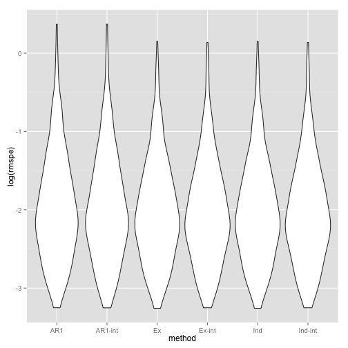
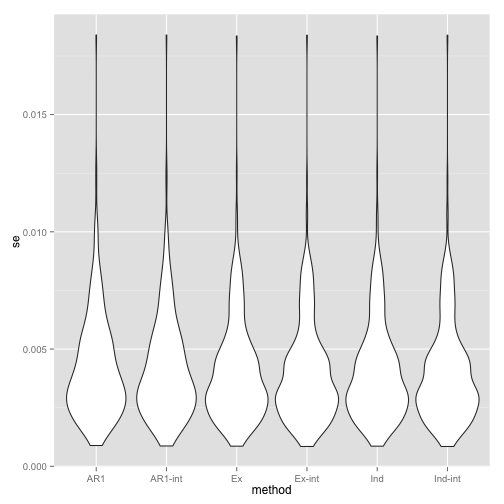
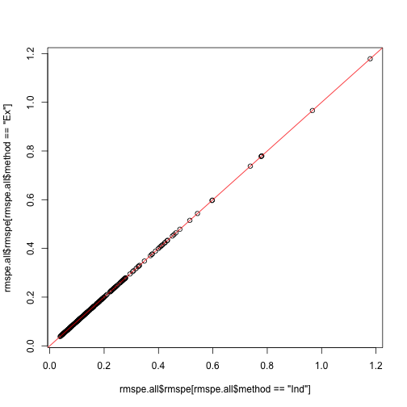
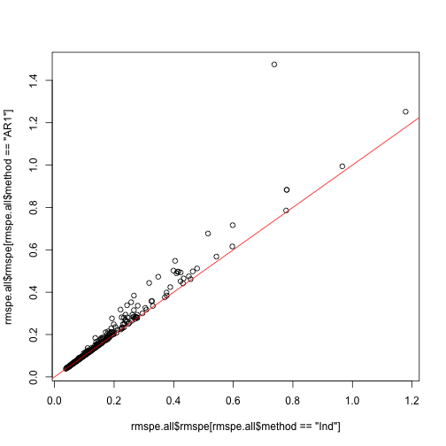
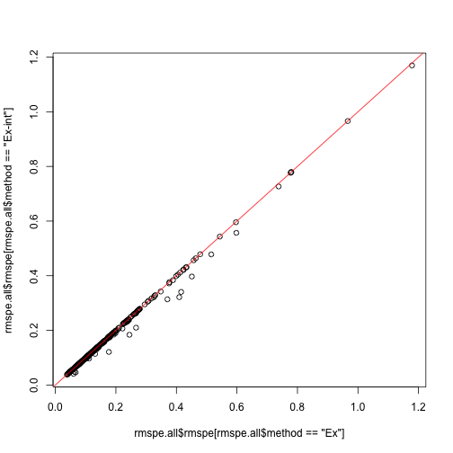
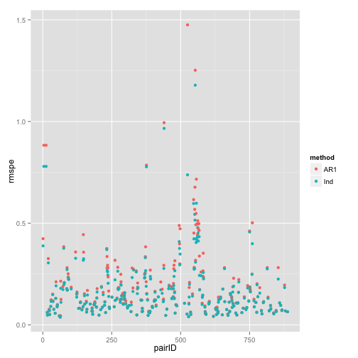
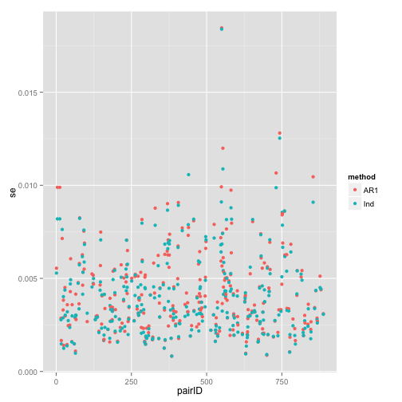

Calculate RMSPE
=====================

# Setup

## Libraries

<pre class="knitr r">## Load libraries
## Available from http://cran.r-project.org/web/packages/getopt/index.html
# install.packages("getopt")
library("getopt")

## Available from http://cran.at.r-project.org/web/packages/knitrBootstrap/index.html
# install.packages("knitrBootstrap")
library("knitrBootstrap")

# --- Specify any other libraries you need
# --- Not needed (since you load them in template.R), but good for the report
# --- Anyhow, just copying and pasting from template.R is good
# install.packages("cvTools")
library("cvTools")

# install.packages("geepack")
library("geepack")

# install.packages("ggplot2")
library("ggplot2")
</pre>

## Directories

<pre class="knitr r">## Chr
chr <- paste0("chr", opt$chrnum)
chrnum <- as.numeric(opt$chrnum)

## Create dir to save files
if(opt$verbose) message("Creating directories")
</pre>

<pre class="knitr r">## Creating directories
</pre>

<pre class="knitr r">ddir <- file.path(opt$dirResult, opt$project, chr) # data directory (might change say if step2 uses the results from step2)
wdir <- file.path(opt$dirResult, opt$project, chr, opt$results) # working dir
dir.create(wdir, recursive=TRUE)
</pre>

<pre class="knitr r">## Warning:
## '/Users/lcollado/enigma2/756final_code/results/derHippo/chr6/rmspe'
## already exists
</pre>

<pre class="knitr r">
## Want to save some 'object'? Use:
# save(object, file=file.path(wdir, "object.Rdata"))
</pre>

# RMSPE

<pre class="knitr r">load(file.path(ddir, "geeAR1", "geeAR1.Rdata"))
load(file.path(ddir, "geeInd", "geeInd.Rdata"))
load(file.path(ddir, "geeEx", "geeEx.Rdata"))
</pre>

## Calculate the RMSPE

<pre class="knitr r">rmspe.all <- vector("list", length(geeAR1))
names(rmspe.all) <- names(geeAR1)

rmspe.all <- lapply(names(rmspe.all), function(x) {
	ar <- unlist(rmspe(y=geeAR1[[x]]$y, yHat=geeAR1[[x]]$fitted.values, includeSE=TRUE))
	ind <- unlist(rmspe(y=geeInd[[x]]$y, yHat=geeInd[[x]]$fitted.values, includeSE=TRUE))
	ex <- unlist(rmspe(y=geeEx[[x]]$y, yHat=geeEx[[x]]$fitted.values, includeSE=TRUE))
	df <- data.frame(rbind(ar, ind, ex))
	df$method <- factor(c("AR1", "Ind", "Ex"))
	df$cluster <- rep(as.integer(x), 3)
	rownames(df) <- NULL
	return(df)
})
rmspe.all <- do.call(rbind, rmspe.all)
save(rmspe.all, file=file.path(wdir, "rmspe.all.Rdata"))
</pre>

## Explore the results

<pre class="knitr r">ggplot(rmspe.all, aes(x=method, y=rmspe)) + geom_violin()
</pre>

<pre class="knitr r">ggplot(rmspe.all, aes(x=method, y=se)) + geom_violin()
</pre>

<pre class="knitr r">plot(rmspe.all$rmspe[rmspe.all$method=="Ind"], rmspe.all$rmspe[rmspe.all$method=="Ex"])
abline(0, 1, col="red")
</pre>

<pre class="knitr r">plot(rmspe.all$rmspe[rmspe.all$method=="Ind"], rmspe.all$rmspe[rmspe.all$method=="AR1"])
abline(0, 1, col="red")
</pre>

<pre class="knitr r">plot(rmspe.all$se[rmspe.all$method=="Ind"], rmspe.all$se[rmspe.all$method=="Ex"])
abline(0, 1, col="red")
</pre>

<pre class="knitr r">plot(rmspe.all$se[rmspe.all$method=="Ind"], rmspe.all$se[rmspe.all$method=="AR1"])
abline(0, 1, col="red")
</pre>

<pre class="knitr r">ggplot(subset(rmspe.all, method!="Ex"), aes(x=rmspe, y=se, color=method)) + geom_point()
</pre>

<pre class="knitr r">ggplot(subset(rmspe.all, method!="Ex"), aes(x=cluster, y=rmspe, color=method)) + geom_point()
</pre>

<pre class="knitr r">ggplot(subset(rmspe.all, method!="Ex"), aes(x=cluster, y=se, color=method)) + geom_point()
</pre>

<pre class="knitr r">tapply(rmspe.all$rmspe, rmspe.all$method, summary)
</pre>

<pre class="knitr r">## $AR1
##    Min. 1st Qu.  Median    Mean 3rd Qu.    Max. 
##  0.0380  0.0851  0.1260  0.1860  0.2120  1.4800 
## 
## $Ex
##    Min. 1st Qu.  Median    Mean 3rd Qu.    Max. 
##  0.0380  0.0821  0.1230  0.1700  0.1960  1.1800 
## 
## $Ind
##    Min. 1st Qu.  Median    Mean 3rd Qu.    Max. 
##  0.0380  0.0821  0.1230  0.1700  0.1960  1.1800
</pre>

<pre class="knitr r">tapply(rmspe.all$se, rmspe.all$method, summary)
</pre>

<pre class="knitr r">## $AR1
##     Min.  1st Qu.   Median     Mean  3rd Qu.     Max. 
## 0.000824 0.002650 0.003680 0.004230 0.005350 0.018500 
## 
## $Ex
##     Min.  1st Qu.   Median     Mean  3rd Qu.     Max. 
## 0.000823 0.002460 0.003390 0.004070 0.005010 0.018400 
## 
## $Ind
##     Min.  1st Qu.   Median     Mean  3rd Qu.     Max. 
## 0.000823 0.002460 0.003390 0.004070 0.005010 0.018400
</pre>

# Reproducibility

Date the report was generated.

<pre class="knitr r">## [1] "2013-12-16 00:38:31 EST"
</pre>

Wallclock time spent generating the report.

<pre class="knitr r">## Time difference of 11.89 secs
</pre>

`R` session information.

<pre class="knitr r">## R version 3.0.2 (2013-09-25)
## Platform: x86_64-apple-darwin10.8.0 (64-bit)
## 
## locale:
## [1] en_US.UTF-8/en_US.UTF-8/en_US.UTF-8/C/en_US.UTF-8/en_US.UTF-8
## 
## attached base packages:
## [1] methods   stats     graphics  grDevices utils     datasets  base     
## 
## other attached packages:
## [1] ggplot2_0.9.3.1      geepack_1.1-6        cvTools_0.3.2       
## [4] robustbase_0.9-10    lattice_0.20-24      knitrBootstrap_0.9.0
## [7] getopt_1.20.0       
## 
## loaded via a namespace (and not attached):
##  [1] colorspace_1.2-4   dichromat_2.0-0    digest_0.6.4      
##  [4] evaluate_0.5.1     formatR_0.10       grid_3.0.2        
##  [7] gtable_0.1.2       knitr_1.5          labeling_0.2      
## [10] markdown_0.6.3     MASS_7.3-29        munsell_0.4.2     
## [13] plyr_1.8           proto_0.3-10       RColorBrewer_1.0-5
## [16] reshape2_1.2.2     scales_0.2.3       stringr_0.6.2     
## [19] tools_3.0.2
</pre>

