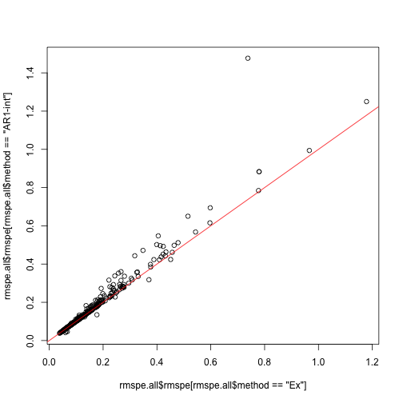
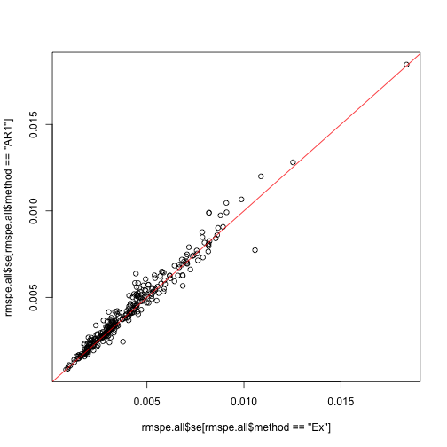
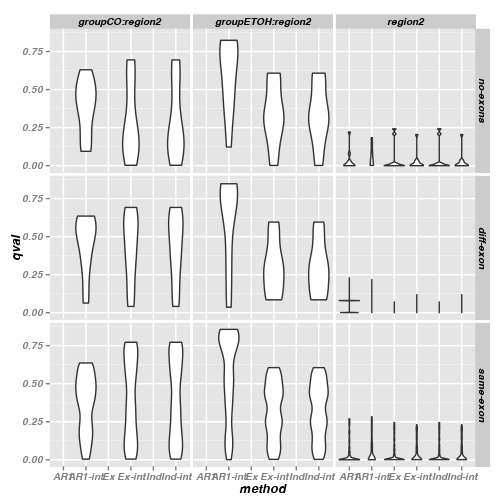

Calculate RMSPE, qvalues and compare with exons
===============================================

# Setup

## Libraries

<pre class="knitr r">## Load libraries
## Available from http://cran.r-project.org/web/packages/getopt/index.html
# install.packages("getopt")
library("getopt")

## Available from http://cran.at.r-project.org/web/packages/knitrBootstrap/index.html
# install.packages("knitrBootstrap")
library("knitrBootstrap")

# --- Specify any other libraries you need
# --- Not needed (since you load them in template.R), but good for the report
# --- Anyhow, just copying and pasting from template.R is good
# install.packages("cvTools")
library("cvTools")

# install.packages("geepack")
library("geepack")

# install.packages("ggplot2")
library("ggplot2")

# source("http://bioconductor.org/biocLite.R")
# biocLite("qvalue")
library("qvalue")
</pre>

## Directories

<pre class="knitr r">## Chr
chr <- paste0("chr", opt$chrnum)
chrnum <- as.numeric(opt$chrnum)

## Create dir to save files
if(opt$verbose) message("Creating directories")
</pre>

<pre class="knitr r">## Creating directories
</pre>

<pre class="knitr r">ddir <- file.path(opt$dirResult, opt$project, chr) # data directory (might change say if step2 uses the results from step2)
wdir <- file.path(opt$dirResult, opt$project, chr, opt$results) # working dir
dir.create(wdir, recursive=TRUE)
</pre>

<pre class="knitr r">## Warning:
## '/Users/lcollado/enigma2/756final_code/results/derHippo/chr6/rmspe'
## already exists
</pre>

<pre class="knitr r">
## Want to save some 'object'? Use:
# save(object, file=file.path(wdir, "object.Rdata"))
</pre>

# RMSPE

<pre class="knitr r">load(file.path(ddir, "geeAR1", "geeAR1.Rdata"))
load(file.path(ddir, "geeInd", "geeInd.Rdata"))
load(file.path(ddir, "geeEx", "geeEx.Rdata"))
</pre>

## Calculate the RMSPE

<pre class="knitr r">rmspe.all <- vector("list", length(geeAR1))
names(rmspe.all) <- names(geeAR1)

rmspe.all <- lapply(names(rmspe.all), function(x) {
	ar <- unlist(rmspe(y=geeAR1[[x]]$y, yHat=geeAR1[[x]]$fitted.values, includeSE=TRUE))
	ind <- unlist(rmspe(y=geeInd[[x]]$y, yHat=geeInd[[x]]$fitted.values, includeSE=TRUE))
	ex <- unlist(rmspe(y=geeEx[[x]]$y, yHat=geeEx[[x]]$fitted.values, includeSE=TRUE))
	df <- data.frame(rbind(ar, ind, ex))
	df$method <- factor(c("AR1", "Ind", "Ex"))
	df$cluster <- rep(as.integer(x), 3)
	rownames(df) <- NULL
	return(df)
})
rmspe.all <- do.call(rbind, rmspe.all)
save(rmspe.all, file=file.path(wdir, "rmspe.all.Rdata"))
</pre>

## Explore the results

<pre class="knitr r">ggplot(rmspe.all, aes(x=method, y=rmspe)) + geom_violin()
</pre>

<pre class="knitr r">ggplot(rmspe.all, aes(x=method, y=se)) + geom_violin()
</pre>

<pre class="knitr r">plot(rmspe.all$rmspe[rmspe.all$method=="Ind"], rmspe.all$rmspe[rmspe.all$method=="Ex"])
abline(0, 1, col="red")
</pre>

<pre class="knitr r">plot(rmspe.all$rmspe[rmspe.all$method=="Ind"], rmspe.all$rmspe[rmspe.all$method=="AR1"])
abline(0, 1, col="red")
</pre>

<pre class="knitr r">plot(rmspe.all$se[rmspe.all$method=="Ind"], rmspe.all$se[rmspe.all$method=="Ex"])
abline(0, 1, col="red")
</pre>

<pre class="knitr r">plot(rmspe.all$se[rmspe.all$method=="Ind"], rmspe.all$se[rmspe.all$method=="AR1"])
abline(0, 1, col="red")
</pre>

<pre class="knitr r">ggplot(subset(rmspe.all, method!="Ex"), aes(x=rmspe, y=se, color=method)) + geom_point()
</pre>

<pre class="knitr r">ggplot(subset(rmspe.all, method!="Ex"), aes(x=cluster, y=rmspe, color=method)) + geom_point()
</pre>

<pre class="knitr r">ggplot(subset(rmspe.all, method!="Ex"), aes(x=cluster, y=se, color=method)) + geom_point()
</pre>

<pre class="knitr r">tapply(rmspe.all$rmspe, rmspe.all$method, summary)
</pre>

<pre class="knitr r">## $AR1
##    Min. 1st Qu.  Median    Mean 3rd Qu.    Max. 
##  0.0380  0.0851  0.1260  0.1860  0.2120  1.4800 
## 
## $Ex
##    Min. 1st Qu.  Median    Mean 3rd Qu.    Max. 
##  0.0380  0.0821  0.1230  0.1700  0.1960  1.1800 
## 
## $Ind
##    Min. 1st Qu.  Median    Mean 3rd Qu.    Max. 
##  0.0380  0.0821  0.1230  0.1700  0.1960  1.1800
</pre>

<pre class="knitr r">tapply(rmspe.all$se, rmspe.all$method, summary)
</pre>

<pre class="knitr r">## $AR1
##     Min.  1st Qu.   Median     Mean  3rd Qu.     Max. 
## 0.000824 0.002650 0.003680 0.004230 0.005350 0.018500 
## 
## $Ex
##     Min.  1st Qu.   Median     Mean  3rd Qu.     Max. 
## 0.000823 0.002460 0.003390 0.004070 0.005010 0.018400 
## 
## $Ind
##     Min.  1st Qu.   Median     Mean  3rd Qu.     Max. 
## 0.000823 0.002460 0.003390 0.004070 0.005010 0.018400
</pre>

# Compare on exons

## Adjust q-values and perform tests

<pre class="knitr r">load(file.path(ddir, "geeAR1", "geeAR1.stat.Rdata"))
load(file.path(ddir, "geeInd", "geeInd.stat.Rdata"))
load(file.path(ddir, "geeEx", "geeEx.stat.Rdata"))

pvals <- vector("list", length(geeAR1))
names(pvals) <- names(geeAR1)

pvals <- lapply(names(pvals), function(x) {
	ar <- geeAR1.stat[[x]]$pval[1]
	ind <- geeInd.stat[[x]]$pval[1]
	ex <- geeEx.stat[[x]]$pval[1]
	df <- data.frame(pval=c(ar, ind, ex))
	df$method <- factor(c("AR1", "Ind", "Ex"))
	df$cluster <- rep(as.integer(x), 3)
	return(df)
})
pvals <- do.call(rbind, pvals)
qvals <- rep(NA, nrow(pvals))
for(i in c("AR1", "Ind", "Ex")) {
	qvals[pvals$method == i] <- qvalue(pvals$pval[pvals$method == i])$qvalues
}
pvals$qval <- qvals
pvals$pvalSig <- pvals$pval < 0.05
pvals$qvalSig <- pvals$qval < 0.10
save(pvals, file=file.path(wdir, "rmspe.all.Rdata"))
</pre>

<pre class="knitr r">summary(pvals)
</pre>

<pre class="knitr r">##       pval        method       cluster         qval        
##  Min.   :0.0000   AR1:300   Min.   :  1   Min.   :0.00000  
##  1st Qu.:0.0000   Ex :300   1st Qu.:234   1st Qu.:0.00000  
##  Median :0.0002   Ind:300   Median :435   Median :0.00007  
##  Mean   :0.1258             Mean   :432   Mean   :0.03588  
##  3rd Qu.:0.0843             3rd Qu.:630   3rd Qu.:0.02841  
##  Max.   :0.9850             Max.   :888   Max.   :0.26950  
##   pvalSig         qvalSig       
##  Mode :logical   Mode :logical  
##  FALSE:252       FALSE:133      
##  TRUE :648       TRUE :767      
##  NA's :0         NA's :0        
##                                 
## 
</pre>

<pre class="knitr r">ggplot(pvals, aes(x=method, y=pval)) + geom_violin()
</pre>

<pre class="knitr r">ggplot(pvals, aes(x=method, y=qval)) + geom_violin()
</pre>

<pre class="knitr r">plot(pvals$qval[pvals$method=="Ind"], pvals$qval[pvals$method=="Ex"])
abline(0, 1, col="red")
</pre>

<pre class="knitr r">plot(pvals$qval[pvals$method=="Ind"], pvals$qval[pvals$method=="AR1"])
abline(0, 1, col="red")
</pre>

<pre class="knitr r">ggplot(subset(pvals, method!="Ex"), aes(x=cluster, y=qval, colour=method)) + geom_point()
</pre>

# Region pairs and exons

<pre class="knitr r">load(file.path(ddir, "ov.Rdata"))

## Regions and exons: number of region pairs per exon
ov.df <- as.data.frame(ov.mat)
ex.tab <- table(ov.df$subjectHits[ ov.df$queryHits %in% unique(pvals$cluster)] )
ex.tab
</pre>

<pre class="knitr r">## 
##    92    94   277   518   546   707  1042  1045  1086  1092  1121  1145 
##     1     1     2     1     1     3     1     1     2     1     2     3 
##  1168  1195  1300  1305  1306  1307  1317  1367  1372  1373  1575  1617 
##     3     1     1     1     1     1     1     3     6     2     3     1 
##  1622  1623  1668  1670  1671  1672  1676  1678  1679  1724  1871  1882 
##     3     2     2     1     2     1     1     1     3     1     1     6 
##  1885  2016  2017  2018  2091  2094  2121  2196  2317  2323  2325  2336 
##     1     1     2     2     1     1     2     1     3     1     1     4 
##  2447  2486  2525  2526  2565  2572  2573  2574  2581  2630  2748  2839 
##     2     2     3     1     2     2     2     8     2     2     2     1 
##  2841  2847  2850  3057  3349  3917  3971  3979  3990  4114  4132  4177 
##     3     1     3     1     1     2     2     5     1     2     2     2 
##  4183  4245  4331  5962  5969  5971  6027  6057  6245  6257  6452  6623 
##     4     1     3     2     2     1     2     1     2     2     4     3 
##  6794  7022  7023  7032  7047  7049  7051  7081  7083  7109  7140  7244 
##     4     3     2     2     1     1     1     1     1     1     1     1 
##  7592  7593  7639  7655  7657  7770  7772  7776  7783  7786  7787  7795 
##     1     1     1     1     1     1     1    18     2     2     2     1 
##  7984  8038  8040  8041  8094  8121  8267  8338  8339  8719  8765  8877 
##     1     3     2     1     2     1     4     3     1     1     3     3 
##  8891  9003  9172  9174  9175  9176  9177  9178  9259  9261  9262  9263 
##     2     2     1     2     1     1     1     1     1     4     1     9 
##  9337  9439  9553  9563  9664  9879 10101 10121 10232 10332 10334 10434 
##     2     1     1     1     1     2     1     2     1     1     1     1 
## 10435 10626 10627 
##     2     2     1
</pre>

<pre class="knitr r">## Exons with more than 1 region
idx.ex <- as.integer(names(ex.tab)[ ex.tab > 1])
ex.use <- ov.df[ ov.df$queryHits %in% unique(pvals$cluster) & ov.df$subjectHits %in% idx.ex, ]
save(ex.use, file=file.path(wdir, "ex.use.Rdata"))
head(ex.use)
</pre>

<pre class="knitr r">##    queryHits subjectHits
## 1          1        5962
## 4          4        5962
## 20        16        5969
## 22        17        5969
## 28        23        6027
## 29        24        6027
</pre>

<pre class="knitr r">
## How many pairs were "linked"?
pvals.ex <- subset(pvals, cluster %in% ex.use$queryHits)
save(pvals.ex, file=file.path(wdir, "pvals.ex.Rdata"))
</pre>

<pre class="knitr r">ggplot(pvals.ex, aes(x=method, y=pval)) + geom_violin()
</pre>

<pre class="knitr r">ggplot(pvals.ex, aes(x=method, y=qval)) + geom_violin()
</pre>

<pre class="knitr r">
plot(pvals.ex$qval[pvals.ex$method=="Ind"], pvals.ex$qval[pvals.ex$method=="AR1"])
abline(0, 1, col="red")
</pre>

<pre class="knitr r">ggplot(subset(pvals.ex, method!="Ex"), aes(x=cluster, y=qval, colour=method)) + geom_point()
</pre>

<pre class="knitr r">
## Judging by p-value
tapply(pvals.ex$pvalSig, pvals.ex$method, summary)
</pre>

<pre class="knitr r">## $AR1
##    Mode   FALSE    TRUE    NA's 
## logical      51     163       0 
## 
## $Ex
##    Mode   FALSE    TRUE    NA's 
## logical      47     167       0 
## 
## $Ind
##    Mode   FALSE    TRUE    NA's 
## logical      47     167       0
</pre>

<pre class="knitr r">casesPval <- do.call(rbind, tapply(pvals.ex$pvalSig, pvals.ex$cluster, as.integer))
table(apply(casesPval, 1, paste, collapse="-"))
</pre>

<pre class="knitr r">## 
## 0-0-0 0-1-1 1-0-0 1-1-1 
##    26    25    21   142
</pre>

<pre class="knitr r">
## Judging by q-value
tapply(pvals.ex$qvalSig, pvals.ex$method, summary)
</pre>

<pre class="knitr r">## $AR1
##    Mode   FALSE    TRUE    NA's 
## logical      27     187       0 
## 
## $Ex
##    Mode   FALSE    TRUE    NA's 
## logical      21     193       0 
## 
## $Ind
##    Mode   FALSE    TRUE    NA's 
## logical      21     193       0
</pre>

<pre class="knitr r">casesQval <- do.call(rbind, tapply(pvals.ex$qvalSig, pvals.ex$cluster, as.integer))
table(apply(casesQval, 1, paste, collapse="-"))
</pre>

<pre class="knitr r">## 
## 0-0-0 0-1-1 1-0-0 1-1-1 
##     8    19    13   174
</pre>

# Reproducibility

Date the report was generated.

<pre class="knitr r">## [1] "2013-12-16 01:42:02 EST"
</pre>

Wallclock time spent generating the report.

<pre class="knitr r">## Time difference of 13.96 secs
</pre>

`R` session information.

<pre class="knitr r">## R version 3.0.2 (2013-09-25)
## Platform: x86_64-apple-darwin10.8.0 (64-bit)
## 
## locale:
## [1] en_US.UTF-8/en_US.UTF-8/en_US.UTF-8/C/en_US.UTF-8/en_US.UTF-8
## 
## attached base packages:
## [1] methods   stats     graphics  grDevices utils     datasets  base     
## 
## other attached packages:
## [1] qvalue_1.36.0        ggplot2_0.9.3.1      geepack_1.1-6       
## [4] cvTools_0.3.2        robustbase_0.9-10    lattice_0.20-24     
## [7] knitrBootstrap_0.9.0 getopt_1.20.0       
## 
## loaded via a namespace (and not attached):
##  [1] Cairo_1.5-3        colorspace_1.2-4   dichromat_2.0-0   
##  [4] digest_0.6.4       evaluate_0.5.1     formatR_0.10      
##  [7] grid_3.0.2         gtable_0.1.2       knitr_1.5         
## [10] labeling_0.2       markdown_0.6.3     MASS_7.3-29       
## [13] munsell_0.4.2      plyr_1.8           proto_0.3-10      
## [16] RColorBrewer_1.0-5 reshape2_1.2.2     scales_0.2.3      
## [19] stringr_0.6.2      tcltk_3.0.2        tools_3.0.2
</pre>

